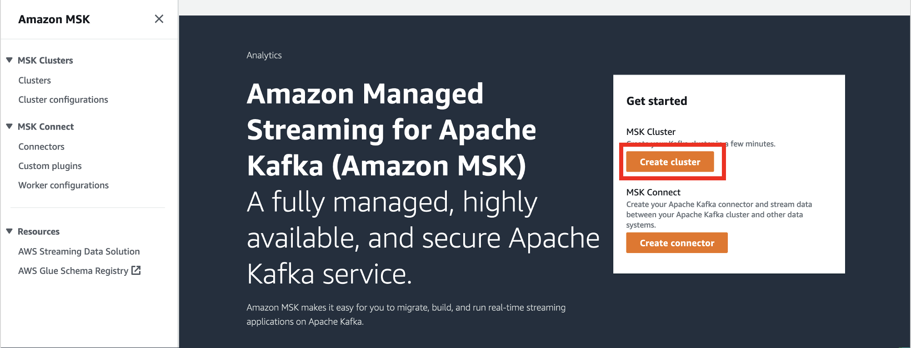
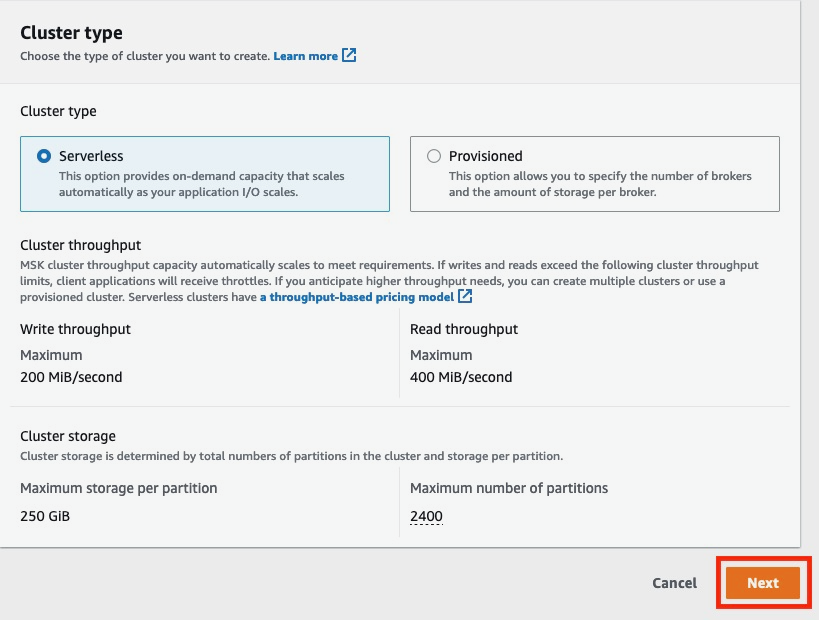
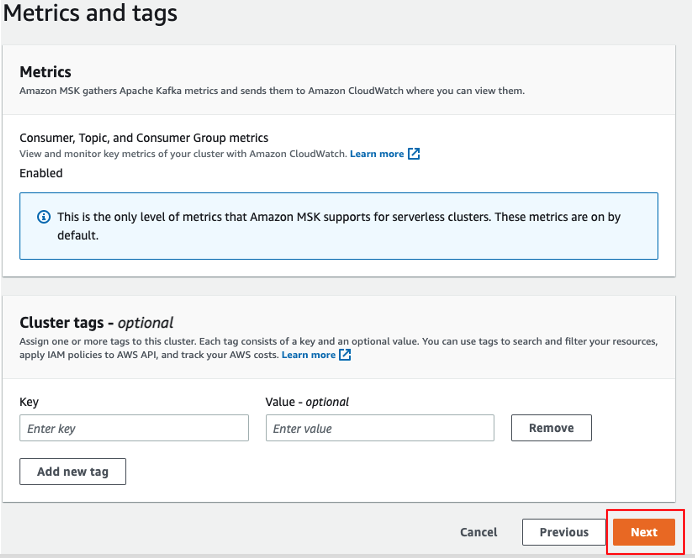
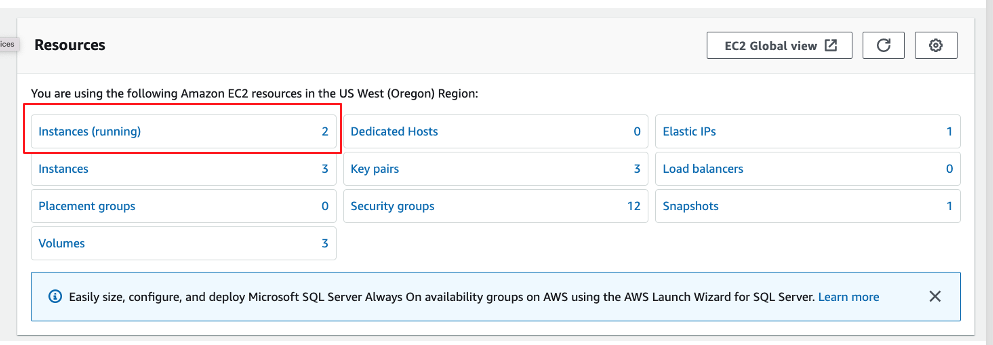
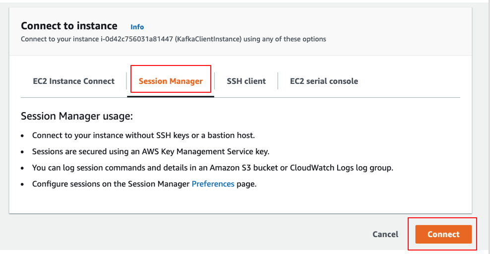
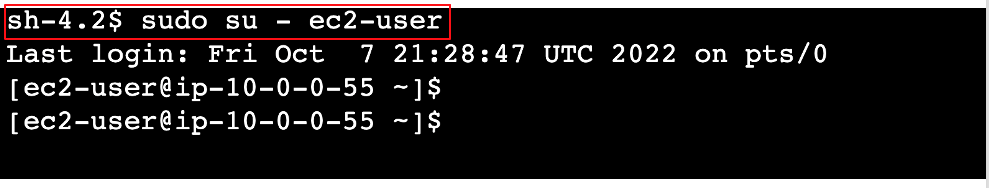
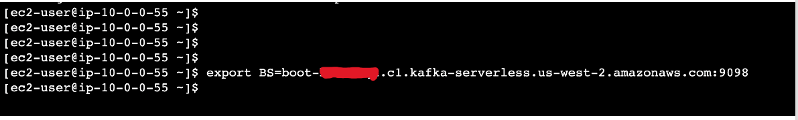
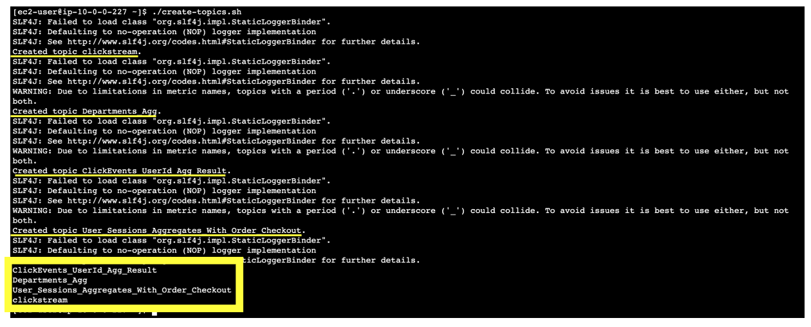

# **Setup MSK Serverless cluster**
# **MSK Serverless Overview**
Apache Kafka is a distributed event store and stream-processing platform. Kafka provides a mechanism to decouple data processing from the source and target destinations as it's highly scalable and resilient. Kafka is very customizable, based on your workload, which introduces operational overhead.

With serverless Kafka the tradeoff is you lose the flexibility of being able to configure the capacity of your cluster while gaining the ability to use Kafka through a single interface that just provides an endpoint for clients.

In this module we will stand up a Serverless Apache Kafka Cluster by navigating through the AWS Console.

# **Create MSK Serverless Cluster**
Navigate to [Amazon MSK console page](https://us-east-2.console.aws.amazon.com/msk/) and click the **Create cluster** button on the top right.



## **Cluster Settings**

Choose **Custom create** to customize cluster networking and other settings. Provide the **Cluster name**.


Ensure cluster type is selected as **Serverless** and click **Next** button.



## **Networking**

In the VPC Configuration section, click **Add subnet** button to have cluster spread across 3 Availability Zones


Select **MMVPC** from the VPC dropdown. For Subnets, select the zones **us-east-2a, us-east-2b, us-east-2c** and choose Subnets with name starting **PrivateSubnetMSK** from dropdown for each zone.


Choose **Custom security groups**, remove the default security group and choose security group with name **MSK Security Group** from dropdown list and click **Next** button.


## **Security**

MSK Serverless defaults to **IAM role-based authentication**. Click **Next** to proceed.


## **Metrics and tags**

Leave it to default and click **Next** to proceed.



## **Review and create**

Review the configuration and click **Create cluster** button.


Wait for couple of minutes for cluster to be created and available to use. Wait for cluster status to change from **Creating** to ** Active**


## **Copy Cluster Endpoint**

Click on the **View client information** button and copy the details of cluster endpoint and save it on notepad for later use.


# **Create MSK Topics**
Now that the cluster is ready and available to use, we need to create Kafka topics to produce and consume data. Please follow instructions below to create Kafka topics needed for this workshop.
## **Connect to Kafka Client**
Navigate to [Amazon EC2 console](https://us-east-2.console.aws.amazon.com/ec2/v2/home)page.

On the EC2 home page click on **Instances(running)** link as show in below image.



On the EC2 instances page select the checkbox for the instance named **KafkaClientInstance** and click on **Connec**t button on top right as shown in below image.


On the page **Connect to instance**, ensure you select the **Session Manager** tab and click on the **Connect** button.



This would open a new tab with EC2 terminal.

## **Create Topics**
On the Terminal, please execute below command to change to ec2-user by running the below command:
```
sudo su - ec2-user
```


Please execute below command to set your MSK cluster broker endpoint to the shell variable BS. Please replace**YOUR_CLUSTER_ENDPOINT** in below command with the endpoint you copied in the last step of previous section as shown in the image.

```
export BS=YOUR_CLUSTER_ENDPOINT
```


Execute command below to create the topics needed for workshop as shown in image

```
./create-topics.sh
```

You will see warnings printed to the terminal like below. You may ignore them.

```
SLF4J: Failed to load class "org.slf4j.impl.StaticLoggerBinder".
SLF4J: Defaulting to no-operation (NOP) logger implementation
SLF4J: See http://www.slf4j.org/codes.html#StaticLoggerBinder for further details.
```


You should see the four MSK topics (**clickstream, Departments_Agg, ClickEvents_UserId_Agg_Result, User_Sessions_Aggregates_With_Order_Checkout**) created.


