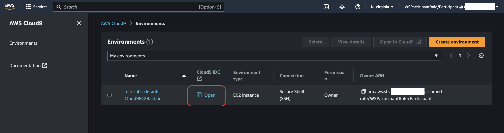
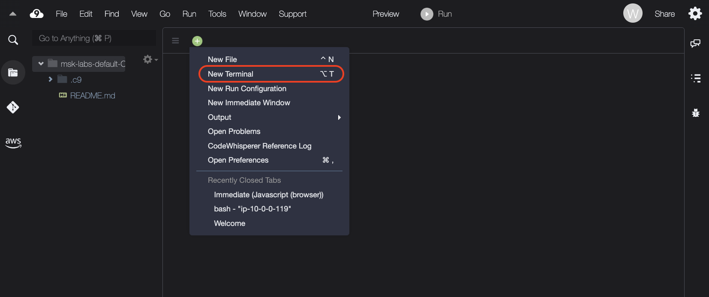
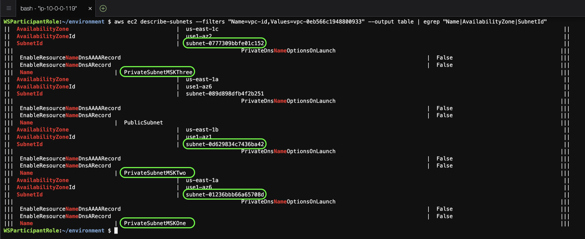
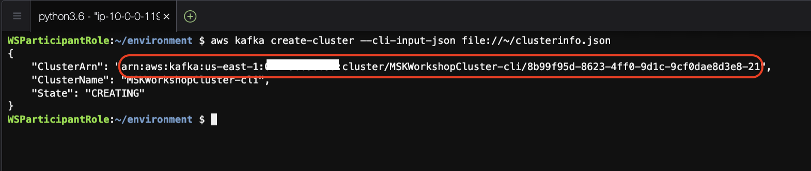
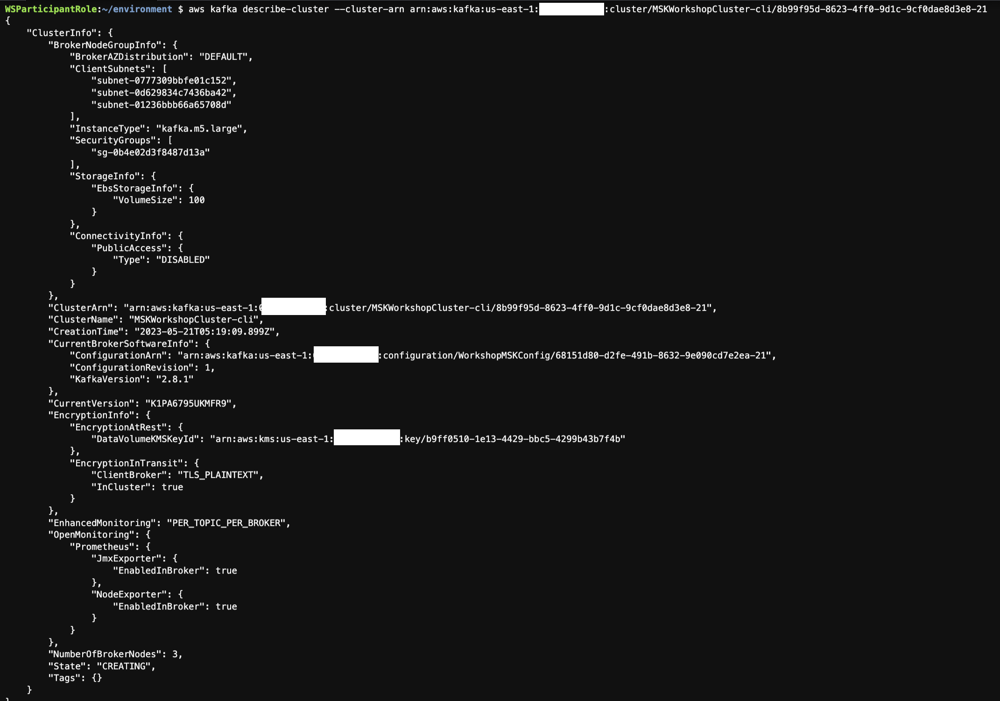
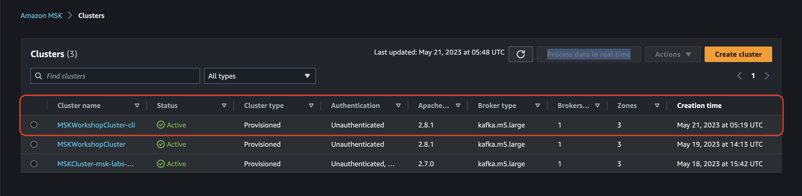

# **Launching an MSK cluster (CLI)**

**In this exercise you will create an Amazon MSK cluster using the AWS CLI.**

## Prepare the Enviroment

### Setting Up Your Cloud9 Workstation Environment

**AWS Cloud9** is a cloud-based integrated development environment (IDE) that lets you write, run, and debug your code with just a browser while providing you with access to a full Linux server.

You will use [AWS Cloud9](https://aws.amazon.com/cloud9/) as your workstation enviroment to run shell commands, Python scripts and SQL queries for the labs.

### Accessing AWS Cloud9 Terminal IDE

1. Go to the [AWS Cloud9 Console](https://us-east-1.console.aws.amazon.com/cloud9control/home?region=us-east-1#/)  and you should see a Cloud9 Environment named **msk-labs-default-Cloud9EC2Bastion**. (Make sure you are in the right AWS Region).
2. Click on Open to launch your AWS Cloud9 Terminal IDE. A new tab will open in your Browser!
> Tip: Now, you can close the first AWS Cloud9 tab in your browser and stick to the new AWS Cloud9 Terminal IDE tab that just opened (the one that partially says msk-labs-default-Cloud9EC2Bastion).
3. Allow for the AWS Cloud9 IDE quick setup to finish, then close the Welcome tab
4. To run commands in Cloud9 you need a terminal. Click on the green plus icon (+) and select new terminal to add a new Command Line Terminal tab: 
> From now on, you will use this terminal window throughout this workshop lab to execute all the AWS CLI commands and scripts.

## Create MSK Cluster (CLI)

### Step-1: Get Subnet Information
We need to get the subnets to deploy the brokers in to. For that, we need to know the VPC ID for the lab.

1. Use the cli to get a list of VPCs in your account 
> aws ec2 describe-vpcs --output table 
2. Look in the table for the VPC you're using for the exercise.  If you are using the VPC created as part of the workshop event, it will be named **MSKVPC**. 
3. Copy the VPCid (example: vpc-0eb566c1948800933) to your notepad 
4. Use the cli to get a list of subnets in that VPC
> aws ec2 describe-subnets --filters "Name=vpc-id,Values=vpc-001ed0757fbb9e2b5" --output table | egrep "Name|AvailabilityZone|SubnetId"

**This will list the subnets in the selected VPC, then grab only the AZ, SubnetID, and Name, making it easier for you to grab the SubnetIds for the 3 private subnets in 3 different AZs. Add these to your notepad for later use. Example: (Highlighted in green)** 

### Step-2: Create a custom cluster configuration

We are going to enable your new Amazon MSK cluster to have the following settings:

| Configuration Name   |      Details      |
|----------|:-------------:|
| auto.create.topics.enable |  allow topics to be created automatically by producers and consumers. This is not typically enabled in a production cluster, but it is handy for development and testing to lower the operational overhead |
| delete.topic.enable |    enables topic deletion on the server. If topic deletion is not enabled, you cannot delete topics. You likely want to turn this on on all clusters you build unless you have a specific need not to.   |
| log.retention.hours | we will set this to 8 hours for the lab. Note that this is the default configuration, it can still be overridden at the topic level  |
    
1. On your Cloud9 terminal, create a file called 'cluster_config.txt' with the following command:
> vi ~/cluster_config.txt

2. Put in the following content (hit i to enter insert mode):

    > auto.create.topics.enable = true

    > delete.topic.enable = true

    > log.retention.hours = 8

3. Press <escape> to exit insert mode, then type :wq! to save and exit
4. Confirm if the file is created successfully, using below command: 
> cat ~/cluster_config.txt

### Step-3: Create the configuration object

Run the following command to push the configuration to the Amazon MSK service for use at cluster creation time:

> aws kafka create-configuration --name "WorkshopMSKConfig" --description "Configuration used for MSK workshop - Auto topic creation; topic deletion; 8hrs retention" --kafka-versions "2.8.1" "2.7.0" --server-properties fileb://cluster_config.txt

The --kafka-versions option is used to tell Amazon MSK which versions of Amazon MSK this configuration is allowed to be used with. If you see an error like the following, then ensure that you've typed in the kafka version string correctly (including quotes):

> An error occurred (BadRequestException) when calling the CreateConfiguration operation: Unsupported KafkaVersion [2.7.1]. Valid values: [1.1.1, 2.1.0, 2.2.1, 2.3.1]

When the command is run, it will return a JSON object, including the ARN for the configuration object. You should copy and paste this in to your text editor for use later, or assign it to an environment variable (export CLUSTER_ARN="arn:..."). Example:

#### Review the configuration created

You can review the configuration using the CLI. Using the ARN provided in the output Step above (or retrieved from aws kafka list-configurations) you can query for your saved configuration:

> aws kafka describe-configuration --arn $CLUSTER_ARN

The output:

For more details on creating and managing Amazon MSK Cluster Configuration, see the [MSK Configuration Operations](https://docs.aws.amazon.com/msk/latest/developerguide/msk-configuration-operations.html)  document.

### Step-4: Create the cluster definition file

To complete this Step, you need the following:

1. Private SubnetID us-east-1a (from step 1 above)
2. Private SubnetID us-east-1b (from step 1 above)
3. Private SubnetID us-east-1c (from step 1 above)
4. Securitygroup ID for the SG "MSKWorkshop-KafkaService" (from Prerequisites lab)
5. Cluster configuration ARN (from step 2 above)

You will now combine the data above into a cluster definition file (clusterinfo.json). It will look something like this, where you will replace the values with the values from above:

Example of a complete file:
~~~~~~~~~~~~~~~~~~~~~~~~~~~~~~~~~~~~~~~
{
  "BrokerNodeGroupInfo": {
     "BrokerAZDistribution": "DEFAULT",
     "InstanceType": "kafka.m5.large",
     "ClientSubnets": [
         "subnet-0777309bbfe01c152", "subnet-0d629834c7436ba42", "subnet-01236bbb66a65708d"
     ],
     "SecurityGroups": [
         "sg-0b4e02d3f8487d13a"
     ],
     "StorageInfo": {
         "EbsStorageInfo": {
            "VolumeSize": 100
         }
     }
  },
  "ClusterName": "MSKWorkshopCluster-cli",
  "ConfigurationInfo": {
     "Arn": "arn:aws:kafka:us-east-1:<aws-account-number>:configuration/WorkshopMSKConfig/68151d80-d2fe-491b-8632-9e090cd7e2ea-21",
     "Revision": 1
  },
  "EncryptionInfo": {
     "EncryptionAtRest": {
         "DataVolumeKMSKeyId": ""
     },
     "EncryptionInTransit": {
         "InCluster": true,
         "ClientBroker": "TLS_PLAINTEXT"
     }
  },
  "EnhancedMonitoring": "PER_TOPIC_PER_BROKER",
  "KafkaVersion": "2.8.1",
  "NumberOfBrokerNodes": 3,
  "OpenMonitoring": {
     "Prometheus": {
         "JmxExporter": {
            "EnabledInBroker": true
         },
         "NodeExporter": {
            "EnabledInBroker": true
         }
     }
  }
}

~~~~~~~~~~~~~~~~~~~~~~~~~~~~~~~~~~~~~~~

### Step 5 - Create the cluster

We can now use the command line tool and the cluster definition to create the cluster:

> aws kafka create-cluster --cli-input-json file://~/clusterinfo.json 

The command will return a JSON object that containers your cluster ARN, name and state. Grab the ARN.

**This step will take some time. You can move on to the next step to see how to monitor progress and review the cluster deployment.**

### Step 6 - Review the cluster deployed

You can check on your cluster configuration and status by using the cli and the **--describe-cluster** option. You will need the cluster arn for this, which you got from the last step.

Use the ARN and get the cluster configuration and state, changing the example ARN to the one from the command above:

> aws kafka describe-cluster --cluster-arn arn:aws:kafka:us-east-1:< AWS_Account_Number >:cluster/MSKWorkshop/20a94343-552f-4298-9076-99673162e023-6 | grep -i state

You can alternatively check the same on the [MSK Console](https://us-east-1.console.aws.amazon.com/msk/home?region=us-east-1#/clusters)
(Right click -> Open Link in New Tab).

When the cluster is ready, you will get the state as "ACTIVE".

You are done here! Proceed to Next Lab.