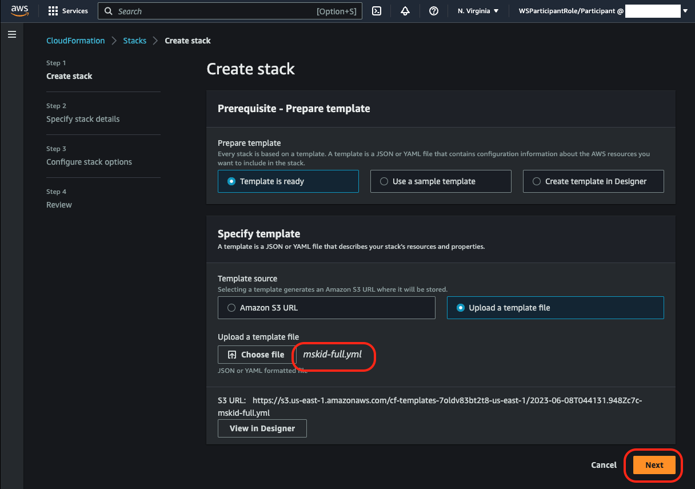
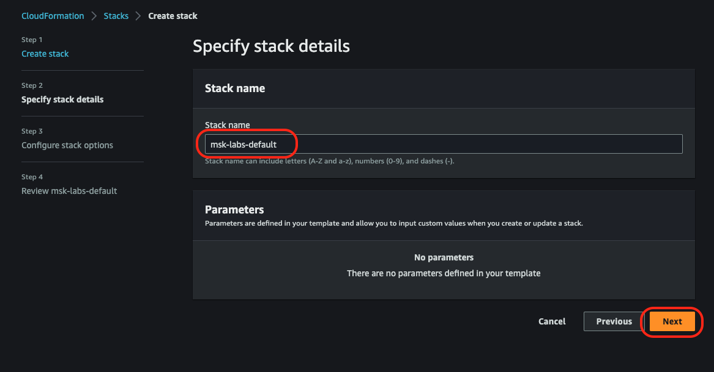
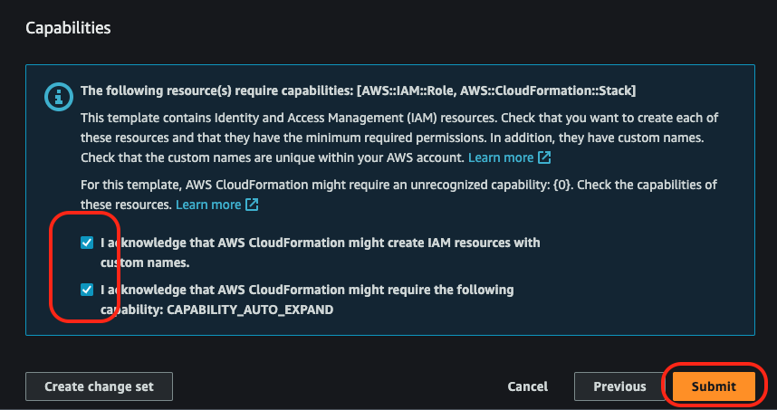
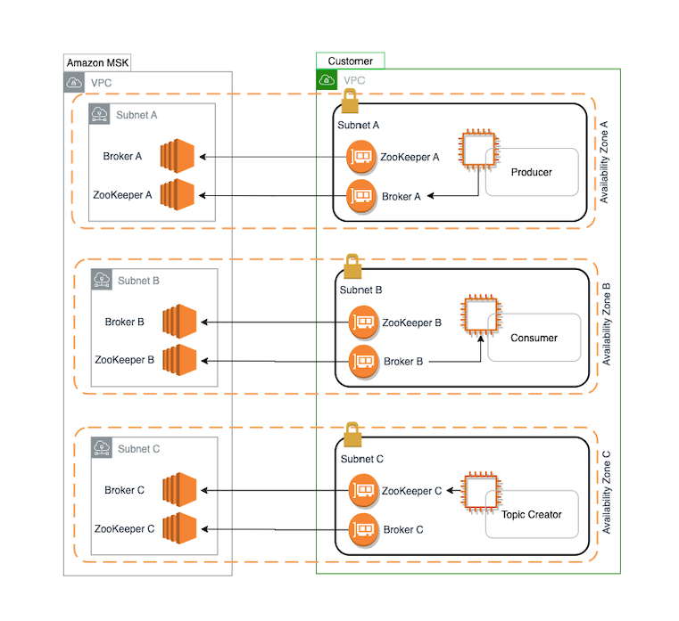

# **Overview**

**This module will walk you through how to use the Console to create a custom configuration and an Amazon MSK Cluster.**

## **Mandatory step**: 

1. Download the [CloudFormation template](https://static.us-east-1.prod.workshops.aws/public/2d05a269-c2a5-45ec-9b7d-bc70cf90a296/static/prepare/mskid-full.yml)

2. Navigate to the [CloudFormation Console](https://us-east-1.console.aws.amazon.com/cloudformation/home)  and deploy the CloudFormation using AWS Console by clicking **Create stack** on the top right and choose **With new resources (standard)** option

3. Select Upload a template file and choose the mskid-full.yml file you downloaded and click **Next**

4. Provide Stack name: **msk-labs-default** and click **Next**

5. Scroll down completely and click **Next**

6. Scroll down completely and Check box both options in **Capabilities** section

7. click **Submit**

## Custom Configuration

The custom configuration will enable us to provide a special configuration to the cluster. Review the available options to make sure you have what you need. For more information about configuration properties, see [Apache Kafka Configuration](https://kafka.apache.org/documentation/#configuration).

To learn how you can create a custom MSK configuration, list all configurations, or describe them, see [Amazon MSK configuration operations](https://docs.aws.amazon.com/msk/latest/developerguide/msk-configuration-operations.html). To create an MSK cluster with a custom MSK configuration, or to update a cluster with a new custom configuration, see Amazon MSK: [How it works](https://docs.aws.amazon.com/msk/latest/developerguide/operations.html).

When you update your existing MSK cluster with a custom MSK configuration, Amazon MSK does rolling restarts when necessary, and uses best practices to minimize customer downtime. For example, after Amazon MSK restarts each broker, Amazon MSK tries to let the broker catch up on data that the broker might have missed during the configuration update before it moves to the next broker.

## Cluster

The cluster will be deployed into an existing VPC, with brokers deployed in 3 private subnets (one per AZ). We will use m5.large nodes for this exercise. If you are using an existing VPC, please ensure that there is a private subnet in each AZ into which you can deploy.

Amazon MSK detects and automatically recovers from the most common failure scenarios for clusters so that your producer and consumer applications can continue their write and read operations with minimal impact. When Amazon MSK detects a broker failure, it mitigates the failure or replaces the unhealthy or unreachable broker with a new one. In addition, where possible, it reuses the storage from the older broker to reduce the data that Apache Kafka needs to replicate. Your availability impact is limited to the time required for Amazon MSK to complete the detection and recovery. After a recovery, your producer and consumer apps can continue to communicate with the same broker IP addresses that they used before the failure.

## Architecture

The diagram demonstrates the interaction between the following components:

### Broker nodes
When creating an Amazon MSK cluster, you specify how many broker nodes you want Amazon MSK to create in each Availability Zone. In the example cluster shown in this diagram, there's one broker per Availability Zone. Each Availability Zone has its own virtual private cloud (VPC) subnet. Amazon MSK offers a 3 AZ or a 2 AZ Apache Kafka node layout. Currently, a 1 AZ (single AZ) Amazon MSK cluster is not available.

### ZooKeeper nodes
Amazon MSK also creates the Apache ZooKeeper nodes for you. Apache ZooKeeper is an open-source server that enables highly reliable, distributed coordination. There is a dedicated ZooKeeper ensemble created for each Amazon MSK cluster that is fully obfuscated and included with each cluster at no additional cost.

### Producers, consumers, and topic creators
Amazon MSK lets you use Apache Kafka data-plane operations to create topics and to produce and consume data.**

**AWS CLI** - You can use the AWS Command Line Interface (AWS CLI) or the APIs in the SDK to perform control-plane operations. For example, you can use the AWS CLI or the SDK to create or delete an Amazon MSK cluster, list all the clusters in an account, or view the properties of a cluster.
