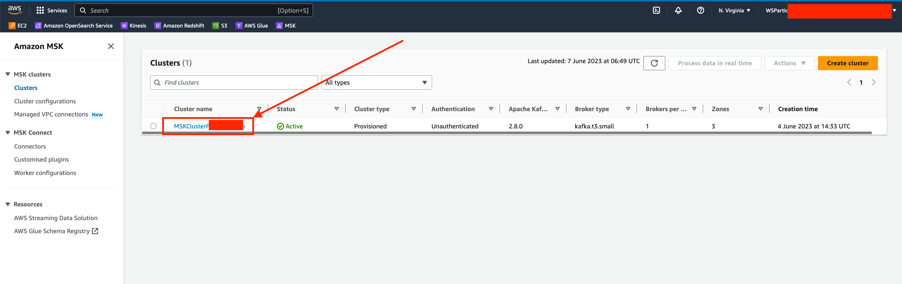
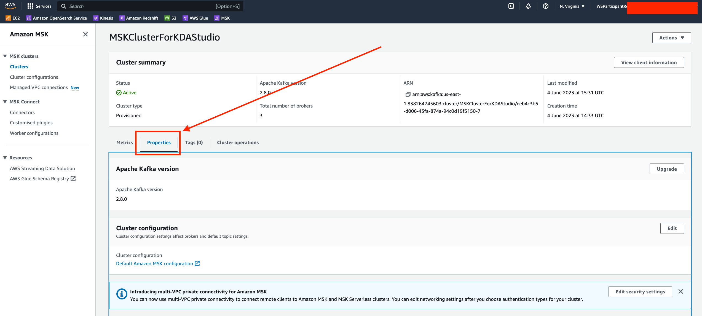
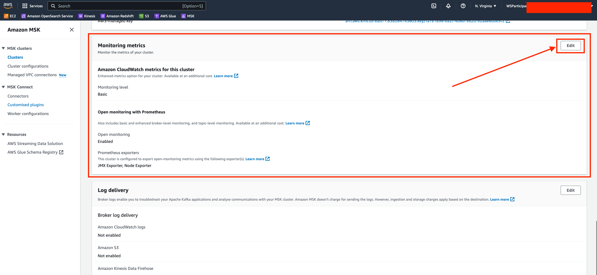
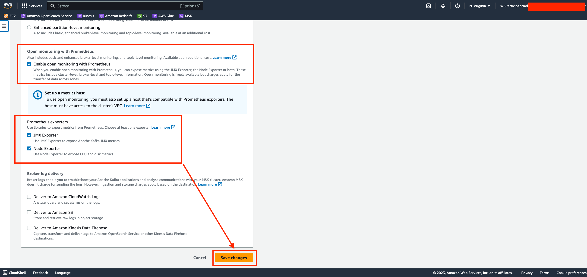

# **Step 1 - Enabling open monitoring for an existing Amazon MSK cluster**

```
To enable open monitoring, make sure that the cluster is in the ACTIVE state.
```
**Using the AWS Management Console**
1. Sign in to the AWS Management Console, and open the Amazon MSK console at https://console.aws.amazon.com/msk/home?region=us-east-1#/home/.
2. Choose the name of the cluster that you want to update. This takes you to a page the contains details for the cluster.

3. On the Properties tab, scroll down to find the Monitoring section.

4. Choose Edit.

5. Select the check box next to Enable open monitoring with Prometheus.

6. Choose Save changes.

# **Step 2 - Create Security group rules to allow monitoring access**

##  **Step 2.1 Create new security group**

Start by creating a new security group called "MSK_Monitoring" without any rules.

1. Navigate to the EC2 service and choose the "Security Groups" option in the left-side menu.
2. At the top of the screen, click on "Create Security Group."
3. Provide the name "MSK_Monitoring" for the security group.
4. Add a description explaining that it allows access to MSK monitoring from monitoring services.
5. Make sure to select the VPC (Virtual Private Cloud) where your Amazon MSK Cluster is deployed, which is referred to as "MSKVPC."
6. After confirming the settings, click on "Create" without adding any specific rules.

## **Step 2.2 Modify the MSK Workshop Service**

1. Access the EC2 service and navigate to the "Security Groups" section.
2. Locate the security group named "MSKWorkshop-KafkaService" and select it.
3. In the bottom pane, click on the "Edit" button to modify the security group's rules.
4. Add a new rule with the following specifications:

Type: Custom TCP
Port: 11001-11002
Source: Select the "MSK_Monitoring" security group
Description: Specify "Prometheus monitoring"

By following these steps, you will open the "MSKWorkshop-KafkaService" security group, add a custom TCP rule for ports 11001 to 11002, allowing access from the "MSK_Monitoring" security group. The purpose of this rule is to enable Prometheus monitoring.

## **Step 2.3 Attach the MSK_Monitoring SG to your Cloud9 instance**

1. Open the EC2 console and navigate to the "Instances" section.
2. Locate your Cloud9 host with the name "aws-cloud9-msklab.." in the list of instances.
3. Click on "Actions" from the top bar.
4. From the dropdown menu, select "Security" and then choose "Change Security Groups."
5. Search for the "MSK_Monitoring" security group and select it.
6. Click on "Add security group" to include the "MSK_Monitoring" group in the Cloud9 instance's security configuration.
7. Finally, press "Save" in the bottom right corner to save the changes.

