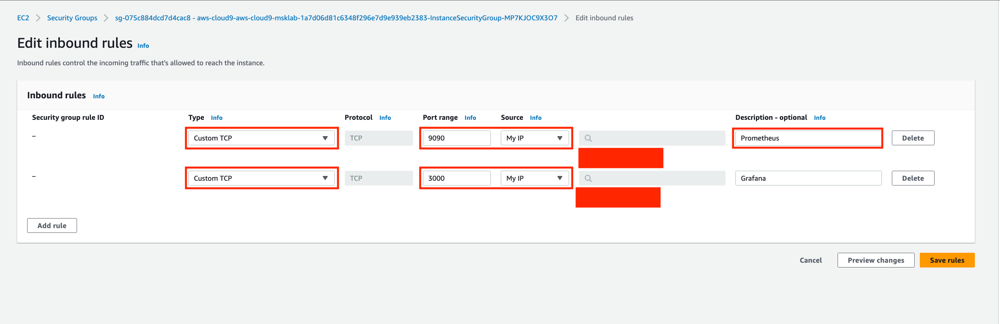
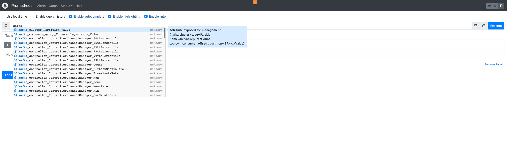

# **Run Prometheus using Docker**
1. Open Cloud9 terminal.
2. Create a prometheus directory to work in
```
mkdir prometheus
cd prometheus
```
3. Create a service configuration file and name it `prometheus.yml`
```yaml
# file: prometheus.yml
# my global config
global:
  scrape_interval:     10s

# A scrape configuration containing exactly one endpoint to scrape:
# Here it's Prometheus itself.
scrape_configs:
# The job name is added as a label `job=<job_name>` to any timeseries scraped from this config.
- job_name: 'prometheus'
  static_configs:
  # 9090 is the prometheus server port
  - targets: ['localhost:9090']
- job_name: 'broker'
  file_sd_configs:
  - files:
    - 'targets.json'

```
3. Navigate to the Cluster details section, and under the Properties tab, copy the broker endpoints.

4. Please create a new file called `targets.json`. In this file, replace the placeholders `<broker_dns_[1,2,N]>` with the actual values of your broker endpoints that were collected in step 3.

```json
[
  {
    "labels": {
      "job": "jmx"
    },
    "targets": [
      "<broker_dns_1>:11001",
      "<broker_dns_2>:11001",
      "<broker_dns_N>:11001"
    ]
  },
  {
    "labels": {
      "job": "node"
    },
    "targets": [
      "<broker_dns_1>:11002",
      "<broker_dns_2>:11002",
      "<broker_dns_N>:11002"
    ]
  }
]

```
5. To run Prometheus on Docker, execute the following command:

```bash
sudo docker run -d -p 9090:9090 --name=prometheus -v /home/ec2-user/environment/prometheus/prometheus.yml:/etc/prometheus/prometheus.yml -v /home/ec2-user/environment/prometheus/targets.json:/etc/prometheus/targets.json prom/prometheus --config.file=/etc/prometheus/prometheus.yml
```

This command will pull down the Prometheus container, run it, and mount the configuration files created earlier into the container. Additionally, it will expose the Prometheus service on port 9090. 
Before running Prometheus on Docker, please double-check and ensure the correct path to your configuration files. Make sure the path you provide in the command reflects the actual location of the configuration files on your system.


### Docker Basics
The container will run in the background, allowing other tasks to proceed concurrently. To check the logs, execute the following command:

```shell
sudo docker logs <containerID>
```

To terminate the container, you can use the following command:

```shell
sudo docker stop prometheus
```

To completely remove the container, you must first stop it using the command mentioned earlier. Once the container is stopped, you can proceed to remove it using the following command:

```shell
sudo docker rm prometheus
```

## Update Security Group on your Cloud9 instance for Prometheus and Grafana

To configure the inbound rules for the AWS Cloud9 security group, follow these steps:

1. Open the EC2 service in the AWS Management Console.
2. Select "Security Groups" from the navigation menu.
3. Locate and select the checkbox next to the security group named "aws-cloud9-msklab...".
4. Click on the "Actions" button and choose "Edit Inbound Rules" from the dropdown menu.

5. Click on the "Add Rule" button to add the following rules:

```
Rule 1 - Prometheus:

Type: Custom TCP
Port Range: 9090
Source: MyIP and add the security group "aws-cloud9-msklab..." (the group you're editing) as well
Description: Prometheus

Rule 2 - Grafana:

Type: Custom TCP
Port Range: 3000
Source: MyIP
Description: Grafana
```

Once you have added both rules, click on the "Save Rules" button located at the bottom right corner of the window.




## Connect to Prometheus User Interface

To obtain the IPv4 Public IP address of your AWS Cloud9 instance, follow these steps:

1. Open the AWS Management Console.
2. Switch to the EC2 service.
3. Locate and click on your Cloud9 instance in the list.
4. In the details pane at the bottom, find the "IPv4 Public IP" field.
5. Copy the IPv4 Public IP address displayed in that field.
6. Open your web browser and enter the following URL in the address bar, replacing `<IPv4 Public IP>` with the IPv4 Public IP address you copied earlier:

`http://<IPv4 Public IP>:9090`

Please note that the instructions provided assume that you have already launched and can access your AWS Cloud9 instance.

