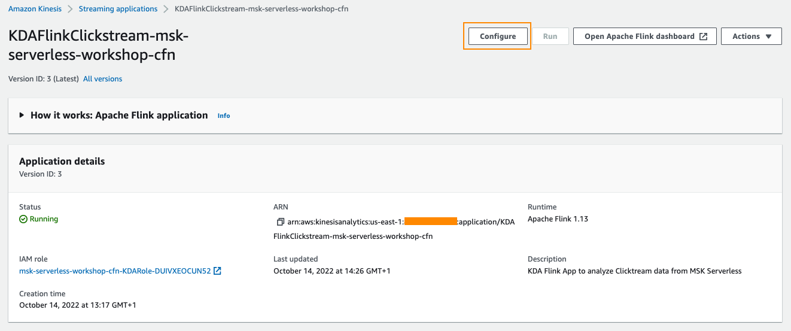
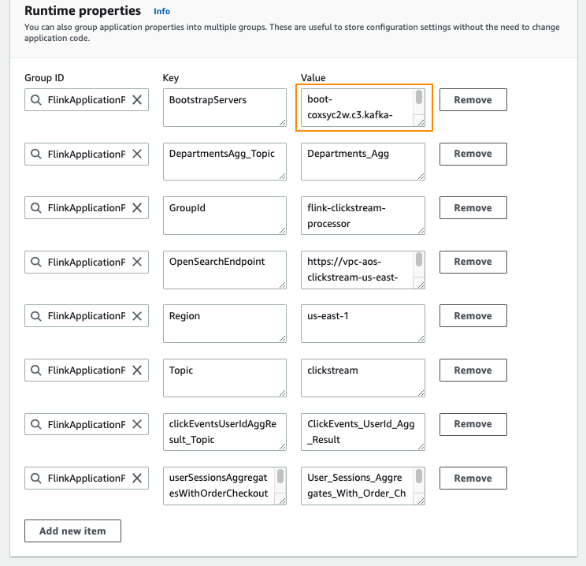
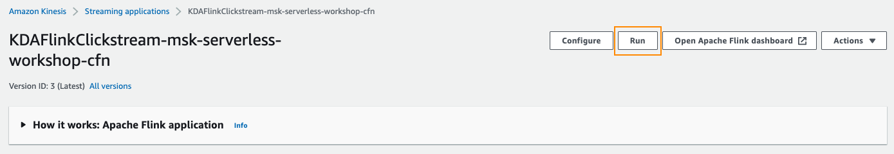
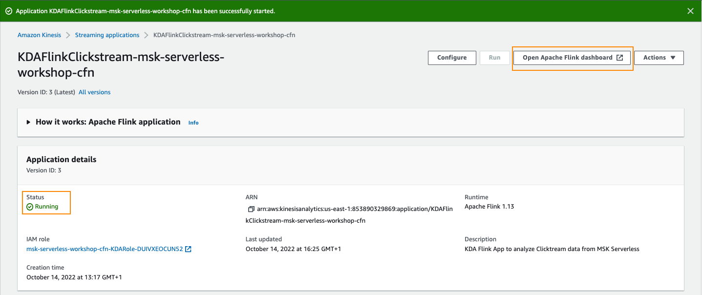
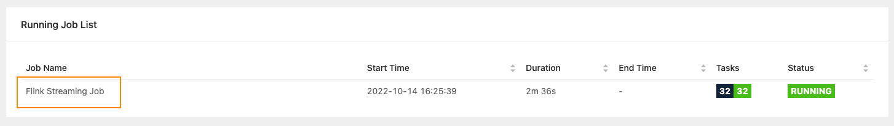
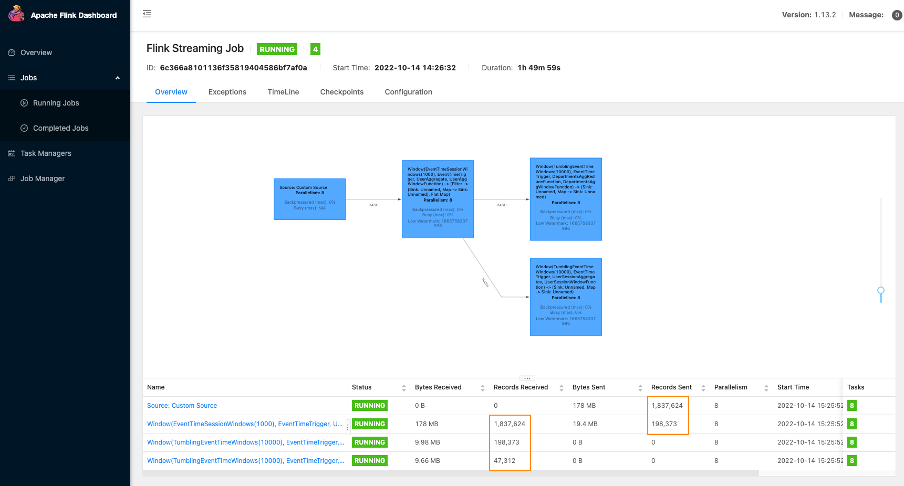
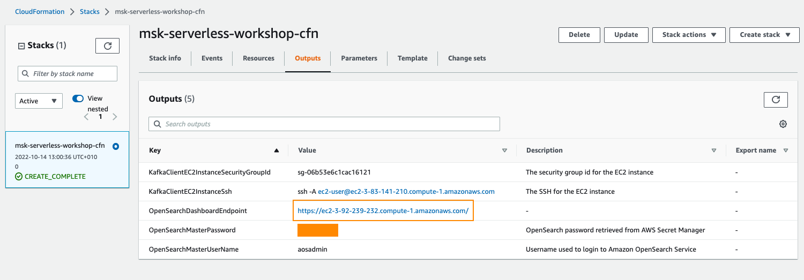
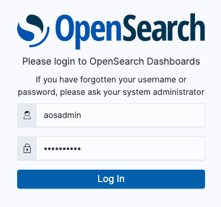
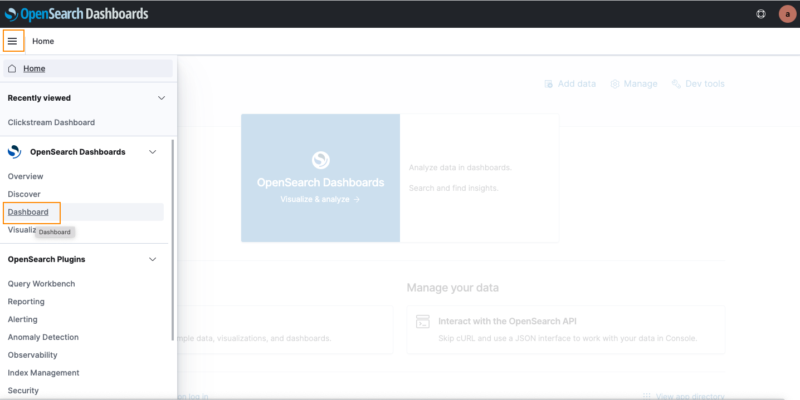
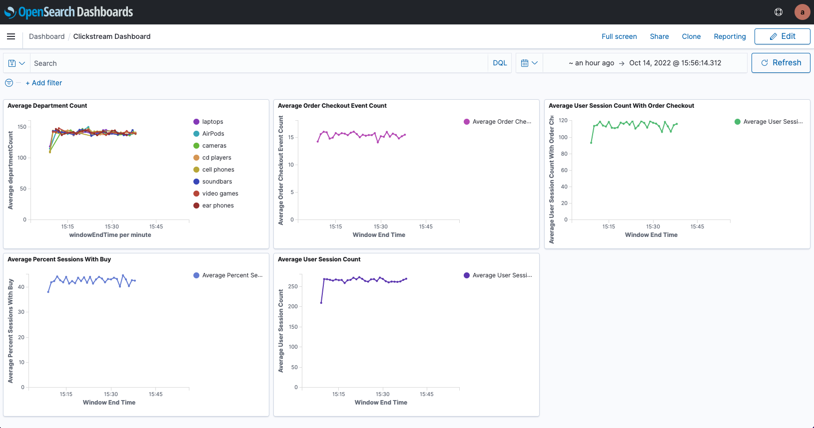

# **Consume using Kinesis Data Analytics and write to Amazon OpenSearch Service**
In this module, we would like to consume data from MSK Serverless cluster using Amazon Kinesis Data Analytics - Flink, process the data and write the data in Amazon OpenSearch Service

The OpenSearch Service is deployed in your AWS account and Dashboards are already configured. We need to configure Kinesis Data Analytics application with correct runtime parameters.

Navigate to the AWS [Kinesis Analytics Console](https://us-east-2.console.aws.amazon.com/kinesisanalytics/) and click on the application **KDAFlinkClickstream-msk-serverless-workshop-cfn**.

## **Configure Kinesis Analytics Application**
Click on the **Configure** button to update the Kinesis Data Analytics configuration.



Scroll to **RunTime Properties** section. Update **BootStrapServers** and keep restof the value as default.



Save your changes.

## **Run Kinesis Analytics Application**
Click on the **Run** button to run the application. This takes a few minutes.



## **Open Apache Flink Dashboard**
Once the Kinesis Analytics application is running, click on **Open Apache Flink dashboard** to open the Flink dashboard.



Click on the Job Name **Flink Streaming Job**



This would show the Job details including the operator directed acyclic graph and data flowing through the operators.



You have now successfully setup a Kinesis Analytics application that reads messages from a Kafka topic, process the data and then write it to Amazon OpenSearch Service.

Lets check the data in OpenSearch Dashboard!

# **Amazon OpenSearch Dashboard Visualisation**
In this module, we would see the dashboard visualisation generated based onthe ingested data from Kinesis Analytics application.

## **Amazon OpenSearch Service**
Go to [AWS CloudFormation Console](https://us-east-2.console.aws.amazon.com/cloudformation/) and click on stack named msk-serverless-workshop-cfn. Go to the Outputs tab of the stack.



Right-click on the **OpenSearchDashboardEndpoint** and click **Open Link in new tab**. This would try to redirect you to the OpenSearch Dashboard login page.

As OpenSearch Service is deployed in a VPC, we are using NGinx reverse proxy to access the OpenSearch Dashboard outside of the VPC.

```
We are using self signed certificate for the Nginx. however recommended to use valid certificate for production.
```

If you are accessing the url using Google Chrome, you have to click on the webpage body and type thisisunsafe. This would redirect you to actual OpenSearch login page.



Go back to the CloudFormation output, retrieve the values for **OpenSearchMasterUserName** and **OpenSearchMasterPassword** and use it for login.

```
Ensure that there are no spaces copied for OpenSearchMasterPassword, else you won't be able to login to OpenSearch Dashboard.
```

Select Global tenant on the popup dialog box.

## **Amazon OpenSearch Dashboard**
Click on the hamburger menu on the left of the screen as highlighted below and then click on **Dashboard**.



This would open the OpenSearch Dashboard where you can see the data gets plotted.



You have now confirmed data flowing to OpenSearch Service and visualizations are rendered.
