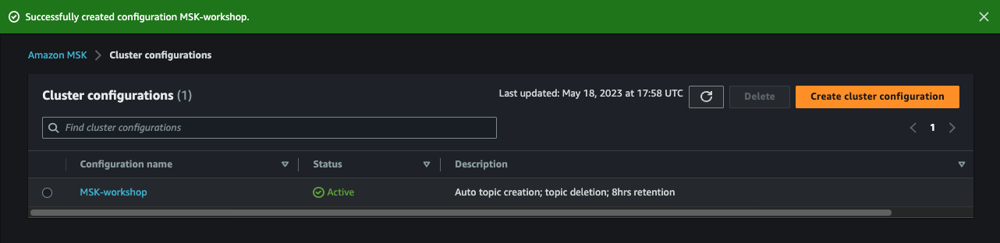
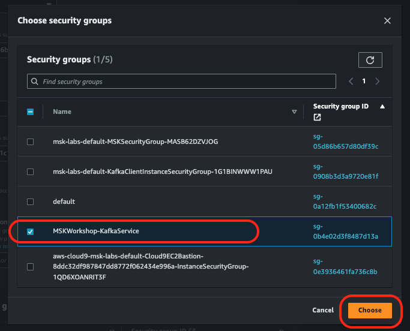
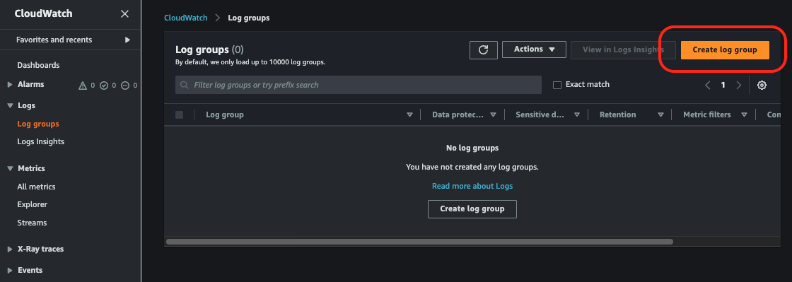

# **Launching an MSK cluster (Console)**

**This exercise is meant to show you different options and features available while trying to create an MSK cluster. MSK clusters required are already created in your event engine accounts which we will use for our exercises.**

## Create MSK Cluster (Console)
Go to the [MSK Landing Page](https://us-east-1.console.aws.amazon.com/msk/home?region=us-east-1#/landing)
(Right click -> Open Link in New Tab).

### Cluster Settings
1. Sign-in to the AWS Console in the account you want to create your cluster in
2. Browse to the MSK create cluster wizard  to start the creation
3. Select **Custom create** for the Creation method
4. Enter the cluster name - **MSKWorkshopCluster**
5. In Cluster type, Choose the option **Provisioned**
6. Select the version of Kafka you want to run on the cluster (ex: **2.8.1**)

#### Brokers

1. Select **kafka.m5.large** as the Broker Instance Type
2. Select the number of zones (availability zones) you want to deploy in to **3**
3. Enter **1** for the number of brokers per zone

**(Your cluster will have 3 total brokers, distributed evenly across your 3 Availability Zones.)**

#### Storage
1. Enter **100** GiB
2. Leave others options as default

#### Configuration Section

We are going to create a custom configuration that the cluster will run. We will enable the following features:

> auto.create.topics.enable - allow topics to be created automatically by producers and consumers. This is not typically enabled in a production cluster, but it is handy for development and testing to lower the operational overhead

> delete.topic.enable - enables topic deletion on the server. If topic deletion is not enabled, you cannot delete topics. You likely want to turn this on on all clusters you build unless you have a specific need not to.

> log.retention.hours - we will set this to 8 hours for the lab. Note that this is the default configuration, it can still be overridden at the topic level 

##### **Create Configuration Object**
1. Select Custom configuration for the Cluster configuration
2. Click on Create configuration  
3. Give your configuration a name - **MSK-workshop**
4. Add a description for the config - **MSK workshop - Auto topic creation; topic deletion; 8hrs retention**
5. Under Configuration Properties, ensure the following options are set/overridden - you can leave the Version as **None** 
>
>auto.create.topics.enable=true
>
>delete.topic.enable=true
>
>log.retention.hours=8

6. Click Create - this will take you to the Cluster Configurations page. You can close this browser tab now 

7. Back in the Cluster Creation workflow, you can hit the refresh icon beside the cluster configuration box (the circle icon) then select the configuration you created 

### Networking
1. Select the VPC you want to deploy your cluster in (**MSKVPC** if you created the VPC using our provided CloudFormation)
2. Select us-east-1a for the first Availability Zone (AZ), then the subnet **(PrivateSubnetMSKOne)**
3. Select us-east-1b for the second AZ, and the appropriate subnet **(PrivateSubnetMSKTwo)**
4. Select us-east-1c for the third AZ, and the appropriate subnet **(PrivateSubnetMSKThree)** 

#### Security Group
1. In the Security groups in Amazon EC2 section, click Browse and select the **msk-labs-default-MSKSecurityGroup-xxxx** security group we created in [prerequisites](http://127.0.0.1:8000/day1/part1/Prerequisites/exercise/#step-2-create-an-msk-security-group) steps. 

2. Click Choose 

### Security
#### Access control methods (Authentication)
1. Select Unauthenticated access for Access control methods. Leave the other access control methods blank as they will be explored in other labs.

#### Encryption

>**Note: You cannot enable encryption on an already created cluster, nor can you turn it off on a cluster configured with encryption, so plan your use carefully to avoid rebuilding to change these settings**

1. In the **Encryption** section, select both **TLS encryption** and **Plaintext** for encryption between clients and brokers. This will enable 2 different service ports on the cluster (9092 and 9094). You will be able to communicate in both an encrypted and unencrypted manner - choose based on your data needs. For this workshop we will experiment with both, but you should choose what fits your production environment best.

2. Select **TLS encryption** for encryption within the cluster
>**Note: that this can impact the performance  of the cluster in production. If you don't need this level of encryption consider leaving it off.**

3. Select Use AWS managed key. This means Amazon MSK will manage the encryption key for you.

4. Click Next

### Monitoring

There are 2 types of monitoring available for Amazon MSK - Cloudwatch monitoring which is available in 4 flavours **(Basic, Enhanced broker-level, Enhanced topic-level, and Enhanced partition-level)**, as well as the Open Monitoring with Prometheus. We will use both.

1. Select **Enhanced topic-level** monitoring. This will enable collection of metrics from each broker at the topic level. This generates more metrics and incurs additional costs, but will also let you troubleshoot and understand your traffic better.

2. Select **Enable open monitoring with Prometheus**

#### Broker Log Delivery
We are going to configure the cluster to send any broker logs to Cloudwatch Logs, which will provide us with an easy way to work with the logs.

1. Click **Deliver to Amazon CloudWatch Log**s - this will expand a new section where you will enter the ARN for the log group. To do this we will need to create a log group first.
2. Click on **visit Amazon CloudWatch Logs console** - this will open a new tab in the CloudWatch Logs console 
3. Click on **Create Log Group** in the top right corner 
4. Enter your log group name - **MSKClusterLogs** and click **Create** 
5. You can now **close** this tab 
6. You should be back in your MSK Cluster Creation window - click **Browse** button, and then check the circle beside **MSKClusterLogs** and then click **Choose**

#### Cluster tags
1. Under key enter **Name** and in value **MSKLabCluster**.
2. Click **Next**

### Review and create

Scroll to the bottom and click **Create cluster** - voila! Your cluster is being built. This can take 10-15 minutes, so it's a good time to grab a coffee, read ahead in the lab, or explore the [MSK Documentation](https://docs.aws.amazon.com/msk/latest/developerguide/what-is-msk.html) 

