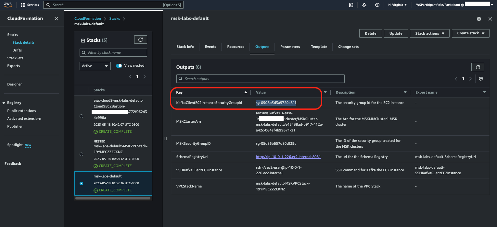

# Prerequisites for running in AWS Event Account**

Please choose the region **'us-east-1'**

## Preparation
The following steps will prepare you for the creation of the Amazon MSK cluster in this lab.

Note that running this module will launch AWS resources that have an associated cost. If you are not running this lab as part of an Amazon MSK workshop using provided accounts, remember to clean up when you are done to keep from incurring ongoing charges for resources left running.

### Get the Client Security Group from Cloudformation

By default, the cluster will be attached to the 'default' security group, which allows all ports between all members of the group. This is fine for testing, but it's not a best practice in production.

We need two security groups - one to attach to producers, consumers, and admin hosts, and the other to attach to the Amazon MSK cluster that references the first.

The CloudFormation template already created one of them - the **Client security group**. Look at the Outputs tab of the **[CloudFormation stack](https://us-east-1.console.aws.amazon.com/cloudformation/home?region=us-east-1#/stacks/outputs) - msk-labs-default** created and copy the value for the key KafkaClientEC2InstanceSecurityGroupId.

### Create an MSK security group

1. Click on Services in the top left corner of the console, and select EC2
2. Go to the [EC2 - Security Groups Page](https://us-east-1.console.aws.amazon.com/ec2/v2/home?region=us-east-1#SecurityGroups:)
(Right click -> Open Link in New Tab).
3. Click Create Security Group

#### Fill out the form as follows:

1. Security group name: **MSKWorkshop-KafkaService**
2. Description: **Access to the Kafka service on the MSK cluster**
3. VPC: [select the VPC you are using for your lab **(MSKVPC)**]
4. Create rules (Under the Inbound rules section. Use the below mentioned configuration)
>#### (a). Click Add rule [Plaintext Kafka Broker Access]
>* Type: Custom TCP
>* Protocol: TCP
>* Port range: 9092
>* Source: [paste the value of the KafkaClientEC2InstanceSecurityGroupId SG you copied in the previous step, from Cloudformation Outputs (msklab-KafkaClientInstance...)]
>* Description: Plaintext Kafka
>#### (b). Click Add Rule [Encrypted Kafka Broker Access]
>* Type: Custom TCP
>* Protocol: TCP
>* Port range: 9094
>* Source: [paste the value of the * KafkaClientEC2InstanceSecurityGroupId SG you copied in the previous step, from Cloudformation Outputs (msklab-KafkaClientInstance...)]
>* Description: Encrypted Kafka
>#### (c). Click Add Rule [Zookeeper Access]
>* Type: Custom TCP
>* Protocol: TCP
>* Port range: 2181
>* Source: [paste the value of the KafkaClientEC2InstanceSecurityGroupId SG you copied in the previous step, from Cloudformation Outputs (msklab-KafkaClientInstance...)]
>* Description: Zookeeper access

5. Click Create security group

6. In the [security group](https://us-east-1.console.aws.amazon.com/ec2/v2/home?region=us-east-1#SecurityGroups:) list, select the Group ID for the **MSKWorkshop-KafkaService** SG, and copy it to your notepad/text editor

You are done here! Proceed to Launching MSK Cluster.