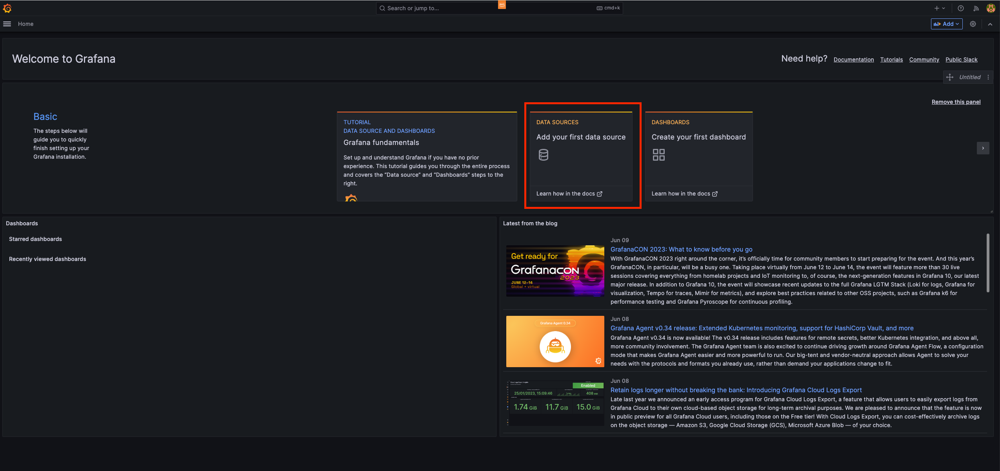
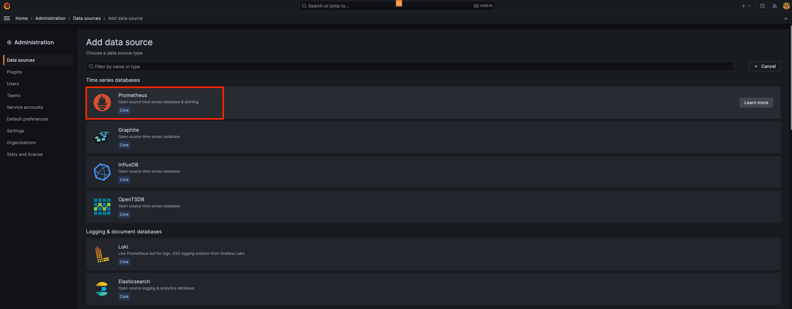
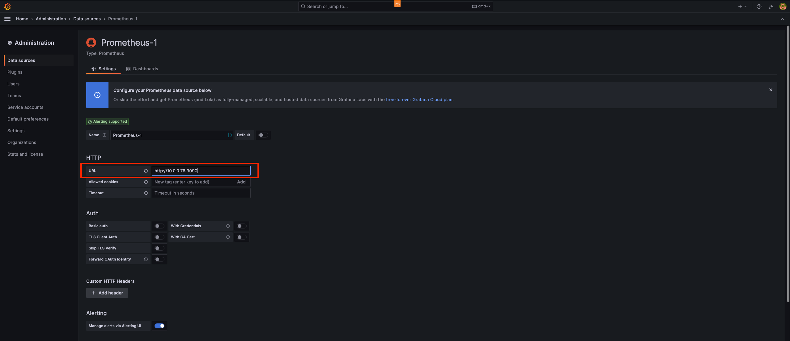
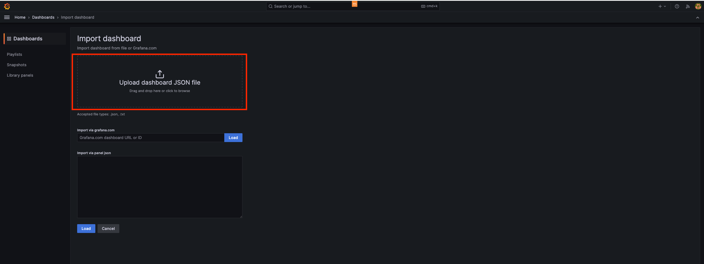
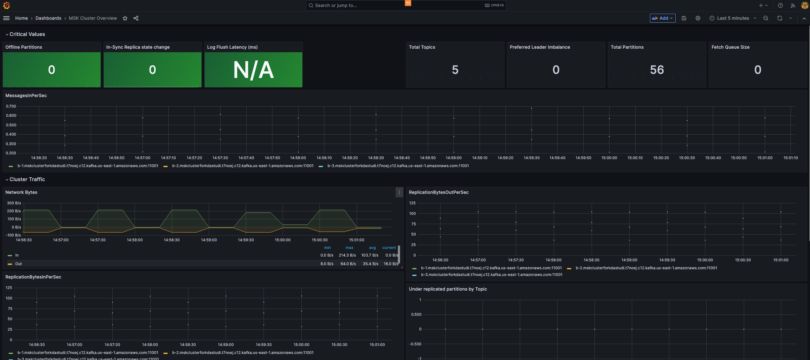

# **Run Grafana using Docker**

Our plan involves utilizing Grafana, an effective tool for visualizing and creating dashboards, to display the metrics of an MSK cluster and its topics. These metrics are collected by Prometheus, which provides a functional interface for reviewing individual metrics. However, when operating Amazon MSK in a production environment, it is preferable to have comprehensive and visually appealing dashboards.

To simplify the process, we will use Docker to run Grafana within the Cloud9 IDE environment. This approach ensures simplicity and ease of use.

1. Launch a shell within the Cloud9 environment.
2. Initiate Grafana using Docker by executing the following command:

```shell
docker run -d -p 3000:3000 --name=grafana -e "GF_INSTALL_PLUGINS=grafana-clock-panel" grafana/grafana
```

This command starts a Docker container named "grafana" based on the Grafana image. The container is set to run in detached mode (-d), and it maps port 3000 of the container to port 3000 of the host.

3. Access Grafana by opening a web browser and entering the Cloud9 public IP Address followed by port 3000 (http://$CLOUD9_EXTERNAL:3000). This allows you to connect to the Grafana user interface.
4. Log in to Grafana using the username "admin" and password "admin".

## **Configure Grafana**

Now, we need to configure a Data Source to fetch Time Series data from Prometheus. Follow these steps:

1. Click on the "Add Data Source" option.

2. Hover over the "Prometheus" option and click on the "Select" button.

3. Fill out the configuration details as follows:

URL: Enter http://$CLOUD9_INTERNAL:9090.
Access: Keep the default setting as "Server".

```
Please note that when configuring the URL for the Prometheus Data Source, you should use the Private IPv4 address of your Cloud9 environment. This address ensures that the communication between Grafana and Prometheus remains within the private network. Replace the placeholder $CLOUD9_INTERNAL with the actual Private IPv4 address of your Cloud9 environment when filling out the configuration.
```



4. Click on "Save and Test". If everything is set up correctly, the test results should come back as green, indicating that the Data Source is functioning properly. If you encounter an error, double-check if your security groups were properly set up during the preparation step.

5. On the Configuration page, locate the "Dashboards" option at the top and click on it. Then, select "Import" next to the "Prometheus 2.0 Stats" option. This action will import a pre-built dashboard specifically designed for monitoring the Prometheus service itself.

## **Import Grafana Dashboard**

1. Download [this file](https://static.us-east-1.prod.workshops.aws/public/e5fd5787-41ca-4fb6-892c-83ed614aa24f/static/openmonitoring/msk_grafana_dashboard.json) to your workstation. This file contains the configuration for a basic Grafana dashboard that provides an overview of your MSK cluster using metrics collected by Prometheus.
2. Return to the Grafana user interface in your web browser.
3. In the left pane, click on the Dashboard icon, typically represented by four squares.

4. Click on the "New" option.
5. Click on the "Import" button.

6. On the top of the screen, click on "Upload .json file."
7. Select the JSON file you previously downloaded (msk_grafana_dashboard.json) from your workstation.

8. After clicking the "Import" button and successfully uploading the JSON file, you will be directed to a screen that displays the imported Grafana dashboard. This screen will resemble the provided screenshot, showing the newly imported dashboard for your MSK cluster.

The displayed Grafana dashboard is designed to showcase the metrics collected from your Amazon MSK cluster through the Prometheus service. It provides visual representations and insights into various aspects of your MSK cluster's performance, allowing you to monitor and analyze key metrics in real-time. With this dashboard, you can gain a thorough understanding of the health and behavior of your MSK cluster, facilitating effective management and troubleshooting.

