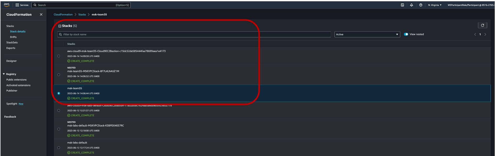
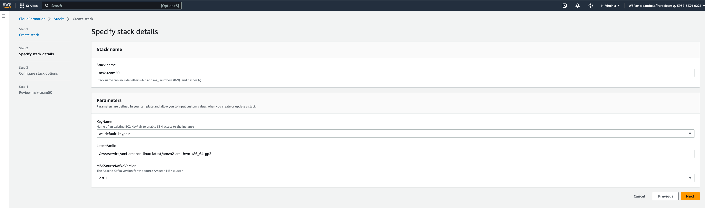
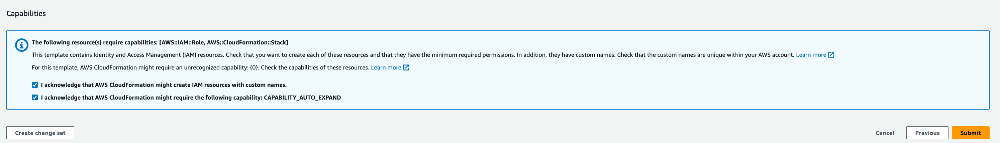

# **Migrate to Amazon MSK Serverless**

In this section, we will be performing a migration from Amazon MSK to Amazon MSK Serverless with the help of [MirrorMaker 2](https://docs.aws.amazon.com/whitepapers/latest/amazon-msk-migration-guide/mirrormaker-2.0-mm2.html). 

Go to your [event dashboard](https://catalog.us-east-1.prod.workshops.aws/join?access-code=8bb7-0416d7-c5). Select **Accept Terms and Conditions** and click on **Join event**. Click on **Open AWS console (us-east-1)** on the bottom left.

Once logged in, go to your [CloudFormation console](https://us-east-1.console.aws.amazon.com/cloudformation/home?region=us-east-1#/stacks?filteringText=&filteringStatus=active&viewNested=true).
   
You should be able to see the following 3 CloudFormation stacks in your account in CREATE_COMPLETE state. If you see these stacks, go to next page. 

If you do not see the stacks in your assigned account, launch the following [CFN stack](https://console.aws.amazon.com/cloudformation/home#/stacks/new?stackName=MSKMM&templateURL=https://aws-streaming-artifacts.s3.amazonaws.com/msk-lab-resources/cfn-templates/MSKServerlessMigrationWithImportsNested.yml) in N. Virginia (us-east-1) region. Make sure that the stack name is "msk-<your team ID or unique hash>". For example: **msk-team20**. Provide **ws-default-keypair** as the PEM key and **/aws/service/ami-amazon-linux-latest/amzn2-ami-hvm-x86_64-gp2** as LatestAmiId.

Accept the IAM capabilities and launch the stack.

   
The stacks take about 25-30 minutes to launch successfully.