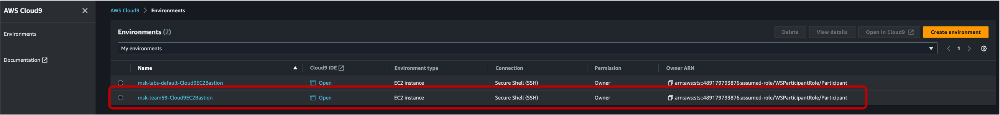
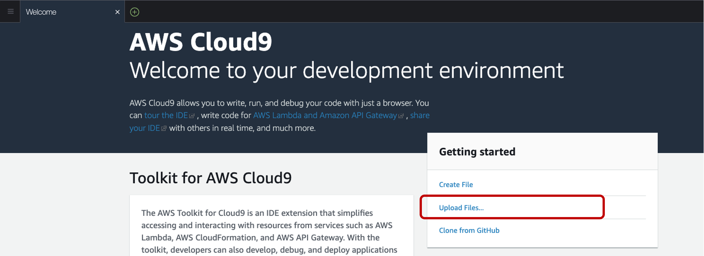
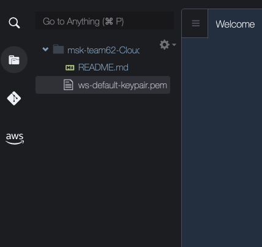

# **Lab Setup**
## **Setup SSH Keys in Cloud9 Enviroment**

1. Go to the [AWS Cloud9 console](https://us-east-1.console.aws.amazon.com/cloud9control/home?region=us-east-1#/).
2. You will see a Cloud9 environment with the name **msk-xxxxxxxxxx**. Open the Cloud9 IDE.



3. In the **Getting started** section, click on **Upload files**
   

4. Click on **Select files**. Pick the EC2 pem file that you downloaded in Event Engine Team Dashboard. Click **Open**. The file will be copied to the **/home/ec2-user/environment** dir and will also be visible in the left pane.


5. Go to the **bash** pane at the bottom and type in the following commands to setup the ssh environment so that you can access the Kafka Client EC2 instances. Run the following commands.

```
chmod 600 ee-default-keypair.pem
eval `ssh-agent`
ssh-add -k ee-default-keypair.pem
```