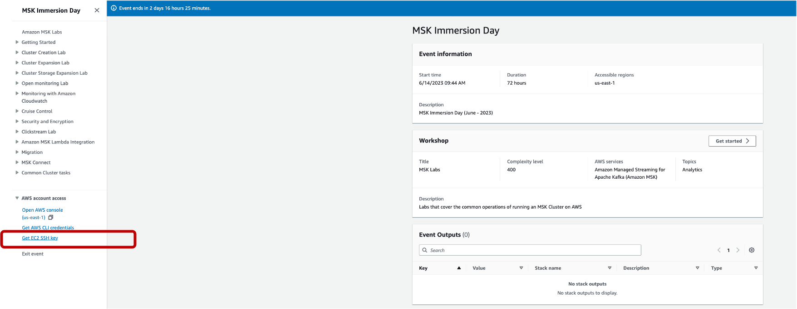
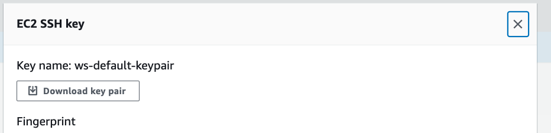
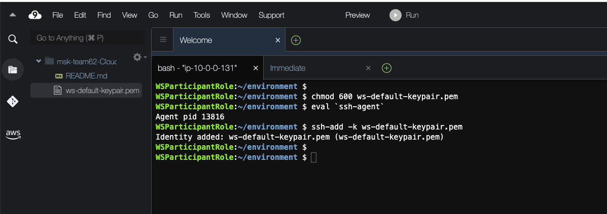

# **Lab Setup**
## **Setup SSH Keys in Cloud9 Enviroment**

Go to your [event dashboard](https://catalog.us-east-1.prod.workshops.aws/join?access-code=8bb7-0416d7-c5) and click on **Get EC2 SSH Key** on the bottom left. 



Download the keypair **ws-default-keypair.pem**



Now, go to the [AWS Cloud9 console](https://us-east-1.console.aws.amazon.com/cloud9control/home?region=us-east-1#/).

You will see a Cloud9 environment with the name **msk-teamXX-Cloud9EC2Bastion**. Open the Cloud9 IDE.


In the **Getting started** section, click on **Upload files**
   


Click on **Select files**. Pick the **ws-default-keypair.pem** file from your desktop. Click **Open**. The file will be copied to the **/home/ec2-user/environment** dir and will also be visible in the left pane.


Go to the **bash** pane at the bottom (you can enlarge the section if you want) and type in the following commands to setup the ssh environment so that you can access the Kafka Client EC2 instances. Run the following commands.

```
chmod 600 ws-default-keypair.pem
eval `ssh-agent`
ssh-add -k ws-default-keypair.pem
    
```

