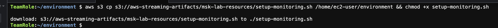
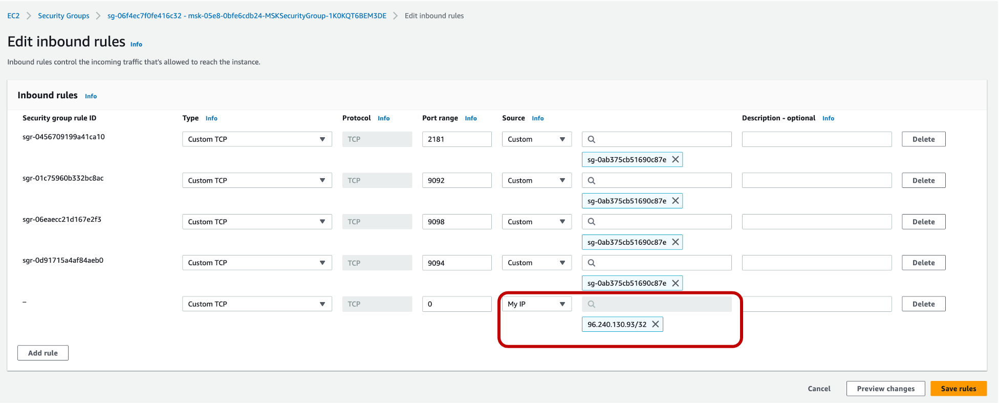
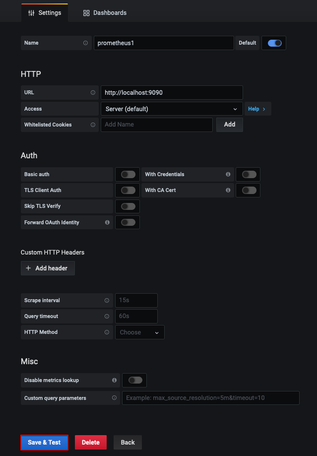
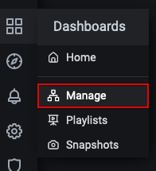
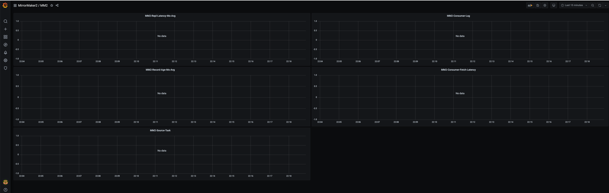

# **Setup Monitoring**

In this section, we will setup Grafana and Prometheus for monitoring MirrorMaker. 

## **Monitoring MirrorMaker 2 on Kafka Connect**

1. Download the monitoring setup script from s3 and make it executable by running the following command on Cloud9 terminal

```
aws s3 cp s3://aws-streaming-artifacts/msk-lab-resources/setup-monitoring.sh /home/ec2-user/environment && chmod +x setup-monitoring.sh
```
Example:



2. Now, let's run the monitoring setup script

* Get the CloudFormation stack name which looks like **msk-xxxxxxxxxxxxxx**. 
* The IP address is the IP that will be given access to the Grafana and Prometheus dashboard urls. Easy way to get your local desktop IP address is to go to [EC2 Security Groups Console](https://us-east-1.console.aws.amazon.com/ec2/home?region=us-east-1#SecurityGroups:). Open **any** security group in the list and click on **Edit inbound rules**. Click on **Add rule** and under **Source**, select **My IP**. 



Make a note of your IP address.

```
./setup-monitoring.sh <stackName> <region> <IPAddress of laptop/32> <filesystem location to install grafana and prometheus>
```
Example: 


3. In the Output check to make sure both the **grafana-server** and the **prometheus** services are running.


4. Run the following commands to get the URL of grafana (first one) and prometheus (second one) servers:

```
echo "http://$(curl -X GET http://169.254.169.254/latest/meta-data/public-hostname):3000"
echo "http://$(curl -X GET http://169.254.169.254/latest/meta-data/public-hostname):9090"
```

5. Go to a browser window and paste in the URL for grafana (first one). Then in the login screen type in **admin** for username and **admin** for password.
   


6. You will be asked to change the password. Please provide a new password and note it down. For the sake of this lab, you can also use **admin** so that you do not forget. 


7. You will now see the home page. On the left panel, click on the **gear** icon and click on **Data Sources**.


8. A prometheus data source is already configured for you. Click on **prometheus1**.
   


9. Scroll down and click on **Save & Test**. 


10. You should get a message saying **Data source is working**.


11. Click on the **Dashboard** icon in the left panel. Then click on **Manage**.
    


12. In the bottom panel, click on **MirrorMaker2**. Then click on **MM2**.


13. The pre-created dashboard will launch. However, you won't see any data yet. Later, when you start the Clickstream producer, consumer and MM2, this dashboard will start getting populated with data. We will come back to the same dashboard and periodically hit the refresh button in the top right corner or adjust the time range to show data in the graph.



* The most important metric here is the **MM2-Consumer-Lag**. It indicates how far behind the end of the log for each partition in the **ExampleTopic** in the source Amazon MSK cluster, the MM2 consumer is. In this graph, I had started the producer first and some time later started MM2. You can see that the lag was pretty high but then dropped to zero as the consumers caught up. Before cutting over the producer, check to make sure that the lag is zero to avoid ordering issues.

