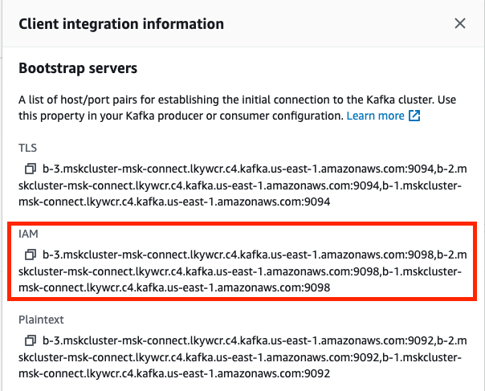
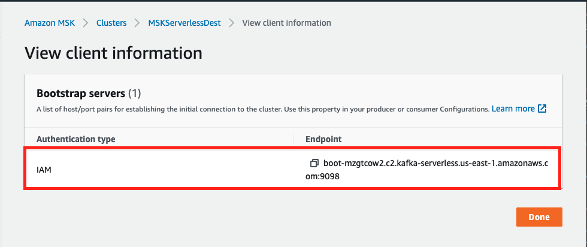
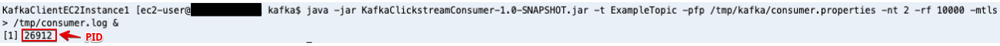

# **Setup pre-migration environment**

## **Simulate pre-migration producer and consumerHeader anchor link**

In this section of the lab, we will be simulating a pre-migration environment with an existing Apache Kafka source cluster (in this lab, this will be an AWS MSK cluster, but it doesn't have to be). This source cluster will have one topic (ExampleTopic), one producer producing to this topic, and a consumer reading from this topic. We will setup a sample source cluster used to simulate existing cluster.

### **Start a producer against the source Amazon MSK cluster**

1. In the Cloud9 terminal, lets setup environment variables and connect to KafkaClientInstance1

```
export MSK_STACK=<<Stack Name>> # IMPORTANT: If running in EventEngine, set MSK_STACK to your unique Event Engine Stack Name, such as mod-xxxxxxx instead of MSKMM
export ssh_cmd1=$(aws cloudformation describe-stacks --stack-name $MSK_STACK --query 'Stacks[0].Outputs[?OutputKey==`SSHKafkaClientEC2Instance1`].OutputValue' --output text)
$ssh_cmd1

```

* Answer yes to "Are you sure you want to continue connecting (yes/no)" and you should be connected to **KafkaClientInstance1**.

2. Goto the /tmp/kafka directory and take a quick look where configuration files and scripts have already been downloaded to this EC2 instance.

```
cd /tmp/kafka
ls

```
* We will be using many of these files in the following steps of this lab. 

3. Get MSK Cluster client information

* Go to the [Amazon MSK console](https://console.aws.amazon.com/msk/home?region=us-east-1#/clusters). Click on the Provisioned MSK cluster that was created by CloudFormation (default name: **MSKSrc-XXXX**)

* Click on **View client information** on the top right side of the page under **Cluster summary**.



* Click on **Copy** under **Bootstrap servers** and paste it in a notepad application.

* Repeat the same steps for the Serverless MSK Cluster that was created by CloudFormation (default name: **MSKServerlessDest**)



4. Run Environment Variable setup script

* We use various environment variables in this lab, so let's run a small shell script to make things more convenient.

```
export brokersmsksource=<Source Bootstrap servers address>
export brokersmskdest=<Serverless Bootstrap servers address>

```
Example: 


* We add some variables to the bash profile and will verify the variables are set correctly, with the final "echo" statement.

```
export region=$(curl http://169.254.169.254/latest/meta-data/placement/region)
echo "export brokersmsksource=${brokersmsksource}" | tee -a ~/.bash_profile
echo "export brokersmskdest=${brokersmskdest}" | tee -a ~/.bash_profile

```

* You should see a value from the last echo command. Make sure you see a value for **$brokersmsksource** before proceeding.

* Next, we configure the **KafkaClientInstance1** with Amazon MSK IAM authentication client.

```
cd /home/ec2-user/kafka/libs
wget https://github.com/aws/aws-msk-iam-auth/releases/download/1.1.0/aws-msk-iam-auth-1.1.0-all.jar

cd  /home/ec2-user
mkdir iam-auth && cd ./iam-auth
wget https://github.com/aws/aws-msk-iam-auth/releases/download/1.1.0/aws-msk-iam-auth-1.1.0-all.jar
cd ../

cat <<EOF > /home/ec2-user/kafka/config/client-config.properties
# Sets up TLS for encryption and SASL for authN.
security.protocol = SASL_SSL

# Identifies the SASL mechanism to use.
sasl.mechanism = AWS_MSK_IAM

# Binds SASL client implementation.
sasl.jaas.config = software.amazon.msk.auth.iam.IAMLoginModule required;

# Encapsulates constructing a SigV4 signature based on extracted credentials.
# The SASL client bound by "sasl.jaas.config" invokes this class.
sasl.client.callback.handler.class = software.amazon.msk.auth.iam.IAMClientCallbackHandler
EOF

export CLASSPATH=/home/ec2-user/iam-auth/aws-msk-iam-auth-1.1.0-all.jar
echo "export CLASSPATH=${CLASSPATH}" | tee -a ~/.bash_profile

```

5. Let's go to the **/home/ec2-user/kafka** dir and create a topic called **ExampleTopic**.

```
cd /home/ec2-user/kafka
bin/kafka-topics.sh --create --bootstrap-server=$brokersmsksource --command-config /home/ec2-user/kafka/config/client-config.properties  --replication-factor 3 --partitions 3 --topic ExampleTopic

```

6. Setup the Producer settings (including Glue Schema Registry and Monitoring)

```
cd /tmp/kafka
cp producer.properties_msk producer.properties_msk_dest
sed -i -e "s/BOOTSTRAP_SERVERS_CONFIG=/BOOTSTRAP_SERVERS_CONFIG=$brokersmsksource/g" producer.properties_msk

export schema_compatibility=FULL_ALL 
export EXTRA_ARGS=-javaagent:/home/ec2-user/prometheus/jmx_prometheus_javaagent-0.13.0.jar=3800:/home/ec2-user/prometheus/kafka-producer-consumer.yml

```
7. Run the Producer and confirm the log output

```
java $EXTRA_ARGS -jar KafkaClickstreamClient-1.0-SNAPSHOT.jar -t ExampleTopic -pfp /tmp/kafka/producer.properties_msk -nt 8 -rf 10800 -nle -gsr -gsrr $region -iam -gar -gcs $schema_compatibility > /tmp/producer.log 2>&1 &

```

* To kill the producer before the 3 hours are up, note down the pid (process id) of the producer process. Use kill <pid> to kill the process.
* The javaagent is a Prometheus JMX exporter that will export the Apacke Kafka producer metrics for Prometheus to scrape and store for queries and visualization.
* To get the source code of the producer see [github](https://github.com/aws-samples/clickstream-producer-for-apache-kafka).
* The output of the previous command:


8. Tail the producer log file to see the producer sending events. Ctrl-C to exit from the tail command.

```
tail -f /tmp/producer.log
```

9. **[Optional]** Check to see if the schema got registered in Schema Registry.

In the [AWS Glue Console](https://us-east-1.console.aws.amazon.com/glue/home?region=us-east-1#/v2/data-catalog/schemas), under **Schema registries -> Schemas**, you should see the **ExampleTopic** registered as the Producer was run with Glue Schema Registry args: *-gsr -gsrr $region -gar -gcs $schema_compatibility*

### **Run a Consumer**

Now, let's configure and run a Kafka Consumer application reading from the previously created ExampleTopic.

1. Setup Consumer environment settings

```
cd /tmp/kafka
cp consumer.properties consumer.properties_dest
sed -i -e "s/BOOTSTRAP_SERVERS_CONFIG=/BOOTSTRAP_SERVERS_CONFIG=$brokersmsksource/g" consumer.properties
export EXTRA_ARGS=-javaagent:/home/ec2-user/prometheus/jmx_prometheus_javaagent-0.13.0.jar=3900:/home/ec2-user/prometheus/kafka-producer-consumer.yml

```

2. Run the Clickstream consumer. The consumer will run in the background for 3 hours.

* To kill the consumer before the 3 hours are up, note down the pid (process id) of the consumer process. 
* Use kill <pid> to kill the process.
* The javaagent is a Prometheus JMX exporter that will export the Apacke Kafka consumer metrics for Prometheus to scrape and store for queries and visualization.*
To get the source code of the consumer see [github](https://github.com/aws-samples/clickstream-consumer-for-apache-kafka). 
  
```
java $EXTRA_ARGS -jar KafkaClickstreamConsumer-1.0-SNAPSHOT.jar -t ExampleTopic -pfp /tmp/kafka/consumer.properties -nt 3 -rf 10800 -src msksource -gsr -iam -gsrr $region  > /tmp/consumer.log 2>&1 &

```
* The output of the previous command should be similar to this:

  
3. Tail the consumer log file to see the consumer reading messages and making progress. Ctrl-C to exit from the tail command.
```
tail -f /tmp/consumer.log
```

