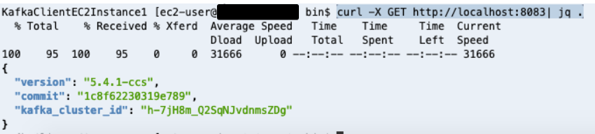

# **MirrorMaker 2 on Kafka Connect**

## **Setup and start MirrorMaker 2 on Kafka Connect**

Since we now have an environment which mimics and existing an Apache Kafka environment with existing Producer and Consumer, let's take the next step to replicate from this Source cluster to a new Destination cluster.

In this section, we setup Kafka Connect and the MirrorMaker 2 Kafka Connect connectors.

### **Setup Kafka Connect cluster**

This section picks up from the previous section. You should still be at a terminal prompt in **KafkaClientInstance1**.

Configure Kafka Connect.

```
cd /tmp/kafka
sed -i -e "s/bootstrap.servers=/bootstrap.servers=$brokersmskdest/g" connect-distributed-iam-auth.properties
cp connect-distributed-iam-auth.properties connect-distributed.properties  

```

Start the Kafka Connect service. It will use the ssl parameters from the /tmp/connect-distributed.properties file and connect to the Amazon MSK cluster.

```
sudo systemctl start kafka-connect.service
sudo systemctl status kafka-connect.service

```
This is the expected output from running these commands:


Make sure the Kafka Connect service started properly.

```
cat /tmp/kafka/kafka-connect.log|grep Herder
```
You should see an output similar to this:


#### Note
It might take a few seconds for it to start up. If you get an output which does not look like the picture below, give it a few seconds and retry the command.
A Distributed herder coordinates with other workers to spread work across multiple processes. In the output you can see that the Herder started successfully and could connect to the Amazon MSK cluster and read the internal Kafka connect topics.*

Confirm Kafka Connect REST Interface

Kafka Connect supports a REST API for managing connectors. The default port for the service is 8083 and we did not change the port in the **connect-distributed.properties** file. On each of the Kafka Client Instances, the service is available at [http://localhost:8083](http://localhost:8083). Run the following command:

```
curl -X GET http://localhost:8083| jq .

```
You should get an output like the following:

  
Observe the topics currently in the source and destination Amazon MSK clusters. Run the following commands:

```
cd /home/ec2-user/kafka
./bin/kafka-topics.sh --bootstrap-server=$brokersmsksource --command-config /home/ec2-user/kafka/config/client-config.properties --list

```
**Note:** The source cluster has the **ExampleTopic** topic the producer is sending records to, in addition to **__consumer_offsets**, and **__amazon_msk_canary** internal topics.

``` 
./bin/kafka-topics.sh --bootstrap-server=$brokersmskdest --command-config /home/ec2-user/kafka/config/client-config.properties --list

```
**Note:** The destination cluster has 3 Kafka connect internal topics starting with the name **connect-**.

**You now have a Kafka Connect cluster running.**

### **(Optional) Kafka Connect multi-node cluster required for MirrorMaker2**

Kafka Connect clusters may be deployed across multiple nodes for both high-availability (HA) and throughput purposes. In this lab, we do not configure an additional Kafka Connect node, but there is the additional EC2 Instance available to do so. Just follow similar steps as the previous sections, but connect to Kafka EC2 Instance 2. To connect to Instance 2 from Cloud9, you can use right side tab and issue the following (similar to steps for Instance 1):

```
export MSK_STACK=<<Stack Name>> # Looks like msk-XXXXXXXXXX
export ssh_cmd2=$(aws cloudformation describe-stacks --stack-name $MSK_STACK --query 'Stacks[0].Outputs[?OutputKey==`SSHKafkaClientEC2Instance2`].OutputValue' --output text)
$ssh_cmd2
```

And then follow similar steps to configure Kafka Connect node as we did on Instance 1.

We are not going to cover running HA Kafka Connect in this lab, but it's important to know it's an option.

### **Configure and start MirrorMaker 2 connectors (with Custom Replication Policy)**

To read more about the connectors and what they do, see the Connectors section in KIP-382. Note: there is not a MM2 Sink Connector/Task available yet as originally described in KIP-382. You may wish to keep on eye on [KIP-656](https://cwiki.apache.org/confluence/display/KAFKA/KIP-656%3A+MirrorMaker2+Exactly-once+Semantics)

We are going to configure and run all 3 of the MirrorMaker2 Connectors

Edit the MirrorMaker 2 Kakfa Connect Connectors properties files

```
cd /tmp/kafka
sed -i -e "s/\"target.cluster.bootstrap.servers\": \"\"/\"target.cluster.bootstrap.servers\": \"$brokersmskdest\"/g" mm2-msc-cust-repl-policy-iam-auth.json
sed -i -e "s/\"source.cluster.bootstrap.servers\": \"\"/\"source.cluster.bootstrap.servers\": \"$brokersmsksource\"/g" mm2-msc-cust-repl-policy-iam-auth.json

sed -i -e "s/\"target.cluster.bootstrap.servers\": \"\"/\"target.cluster.bootstrap.servers\": \"$brokersmskdest\"/g" mm2-cpc-cust-repl-policy-iam-auth-sync.json
sed -i -e "s/\"source.cluster.bootstrap.servers\": \"\"/\"source.cluster.bootstrap.servers\": \"$brokersmsksource\"/g" mm2-cpc-cust-repl-policy-iam-auth-sync.json

sed -i -e "s/\"target.cluster.bootstrap.servers\": \"\"/\"target.cluster.bootstrap.servers\": \"$brokersmskdest\"/g" mm2-hbc-iam-auth.json
sed -i -e "s/\"source.cluster.bootstrap.servers\": \"\"/\"source.cluster.bootstrap.servers\": \"$brokersmsksource\"/g" mm2-hbc-iam-auth.json

```

We are now ready to start each of these connectors. Feel free to review the 3 .json files we modified in the previous sed commands before continuing.

#### **Start MirrorSourceConnectorHeader**

Create a new **MirrorSourceConnector** connector by submitting a request to the REST interface.

```
curl -X PUT -H "Content-Type: application/json" --data @mm2-msc-cust-repl-policy-iam-auth.json http://localhost:8083/connectors/mm2-msc/config | jq '.'

```
The expected output of the command: 


Check the status of the connector.

```
curl -s localhost:8083/connectors/mm2-msc/status | jq .

```

The expected output of the command is:


**Note:** Even though the tasks.max configuration is set to 4, 3 tasks are started as there are 3 partitions in the topic.

#### **MirrorCheckpointConnector**

Create a new **MirrorCheckpointConnector** connector by submitting a request to the REST interface.

```
curl -X PUT -H "Content-Type: application/json" --data @mm2-cpc-cust-repl-policy-iam-auth-sync.json http://localhost:8083/connectors/mm2-cpc/config  | jq .

```
The expected output of the command is:


Check the status of the connector:

``` 
curl -s localhost:8083/connectors/mm2-cpc/status | jq .

```
The expected output of the command is: 


#### **MirrorHeartbeatConnector**

Create a new **MirrorHeartbeatConnector** connector by submitting a request to the REST interface.

```
curl -X PUT -H "Content-Type: application/json" --data @mm2-hbc-iam-auth.json http://localhost:8083/connectors/mm2-hbc/config | jq '.'

```

The expected output of the command is:


Check the status of the connector:

```
curl -s localhost:8083/connectors/mm2-hbc/status | jq .

```
The expected output of the command is:


Observe the topics now in the source and destination Amazon MSK clusters. Run the following commands:

``` 
cd /home/ec2-user/kafka
./bin/kafka-topics.sh --bootstrap-server=$brokersmsksource --command-config /home/ec2-user/kafka/config/client-config.properties --list

```

**Note:** The source cluster has an additional topic called **mm2-offset-syncs.mskdest.internal** which was created by the **MirrorSourceConnector** and is used to sync offsets between the source and destination Amazon MSK clusters as described in [KIP-382](https://cwiki.apache.org/confluence/display/KAFKA/KIP-382%3A+MirrorMaker+2.0#KIP-382:MirrorMaker2.0-InternalTopics).

```
./bin/kafka-topics.sh --bootstrap-server=$brokersmskdest --command-config /home/ec2-user/kafka/config/client-config.properties --list

```

**Note:** The destination cluster has 3 additional topics now. The **ExampleTopic** which was created by the **MirrorSourceConnector** and is the replicated topic. Also, the MirrorMaker 2 internal topics **heartbeats** and **msksource.checkpoints.internal** topics which were created by the **MirrorHeartbeatConnector** and the **MirrorCheckpointConnector** connectors respectively. To learn more on MirrorMaker 2 internal topics as described in KIP-382, see [MirrorMaker2 Internal Topics](https://cwiki.apache.org/confluence/display/KAFKA/KIP-382%3A+MirrorMaker+2.0#KIP-382:MirrorMaker2.0-InternalTopics).

You now have a MirrorMaker 2 cluster running on Kafka Connect that is replicating topics, topic configurations, topic acls, groups and topic messages to the destination Amazon MSK cluster.

### Verify MirrorMaker2 replication status using Grafana setup in the monitoring section

Go back to the browser window with the Grafana dashboard from the Monitoring section and hit refresh in the top right corner. You will now see data in the dashboard, and you can see the consumer lag starting high but going to zero shortly as the MM2 consumers catch up in the graph in the top right.

