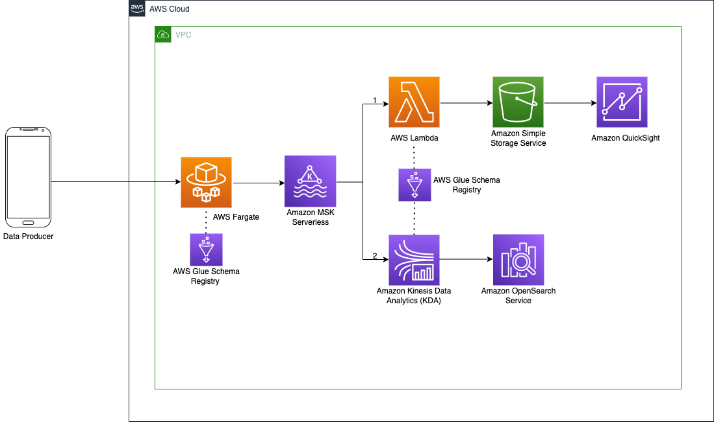

# **Introduction**

Serverless services allow us to build applications without having to worry about the underlying infrastructure. This allows developers to avoid provisioning, scaling, and managing resource utilization. In this workshop we will build a serverless data pipeline using [Amazon MSK Serverless](https://aws.amazon.com/msk/features/msk-serverless/) which enables data to be consumed from many different client applications to accomplish downstream tasks such as dashboards and analytics.

Attendees will will learn how to:  
1. Start a Serverless MSK Cluster  
2. Deploy a Kafka Client Container based Lambda Function  
3. Ingest data from various sources into a Kafka Client  
4. Consume data for downstream tasks such as Quicksight Dashboards  

This is a 300-level workshop, so some familiarly with using serverless services such as Lambda and Fargate ishelpful. No Apache Kafka experience is necessary. This workshop is intended to be finished in 2 hours.
