# **Produce clickstream data to MSK Serverless using Elastic Container Service**
Now that we have successfully created topics in our cluster, our next step is to produce data to the cluster. In this step we will deploy a serverlessECS Fargate container that runs an application to produce sample clickstream data to MSK Serverless cluster.

Navigate to [Amazon ECS console](https://us-east-2.console.aws.amazon.com/ecs/home) page.

On the left side menu click on **Task Definitions** to navigate to page that displays available Task Definitions.

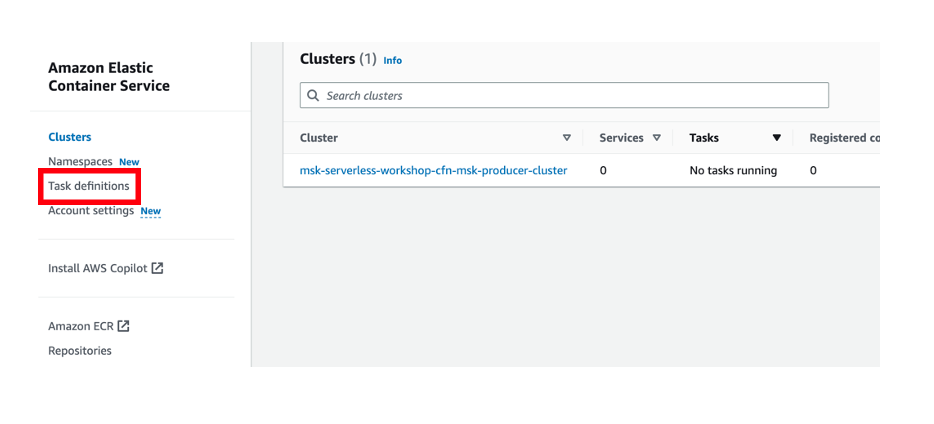
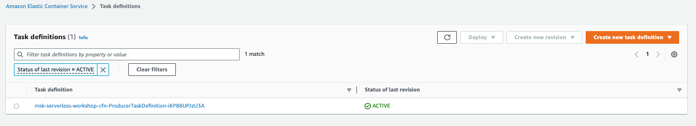

Select the checkbox against the available Task Definition and Click on **Run Task** option from **Deploy** menu.

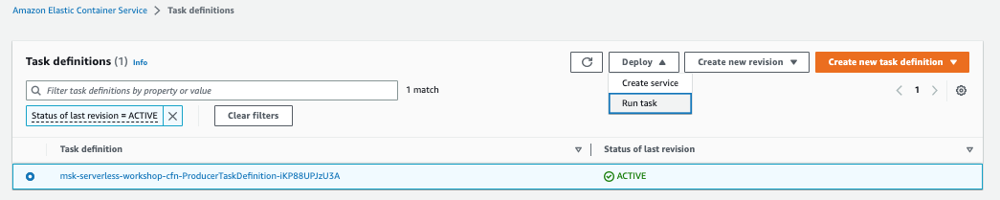

## **Run Task**
On the Run Task page, select **Fargate** for Launch type option and for theOperating system family select **Linux** from drop down. Refer to below image for more details on other fields

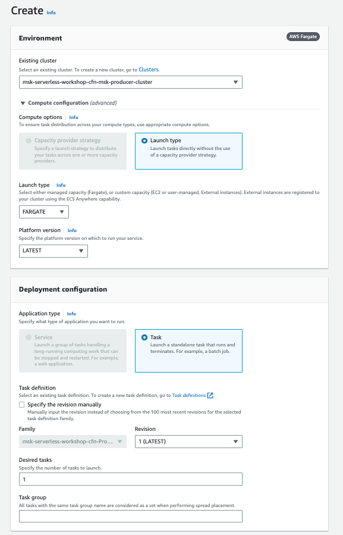

Expand the **Networking** section.

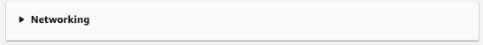

## **VPC and security groups**
Change **VPC** to **MMVPC**. Select **PrivateSubnetMSKOne**, **PrivateSubnetMSKTwo** and **PrivateSubnetMSKThree**.

For **Security Groups**, select Use an existing security group, uncheck thedefault security group, and select the security group name starting with **msk-serverless-workshop-cfn-ProducerECSTaskSecurity**.

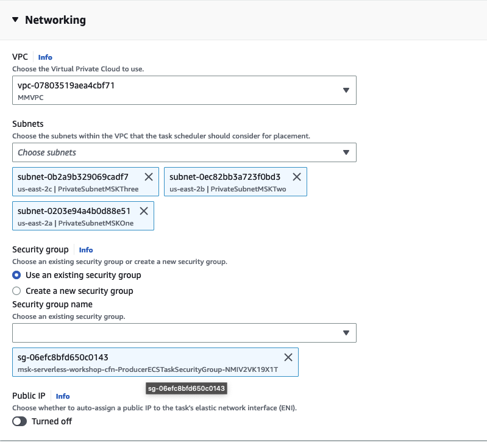

## **Advanced Options**
Expand the section under **Container Overrides**.

For **BOOTSTRAP_STRING** enter the value of your MSK Serverless cluster broker endpoint (you copied this earlier from the [Amazon MSK cluster console page](https://us-east-2.console.aws.amazon.com/msk/), with **View client information**).

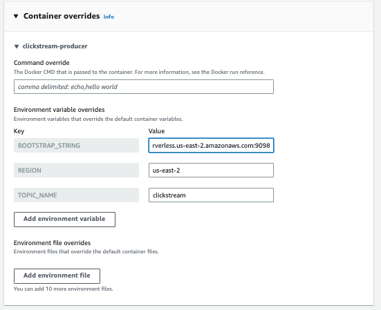

Scroll to the bottom of the page and click on the **Create button**.

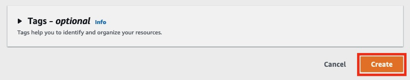

On the new page, wait for your task to get into Running status as shown in below image.

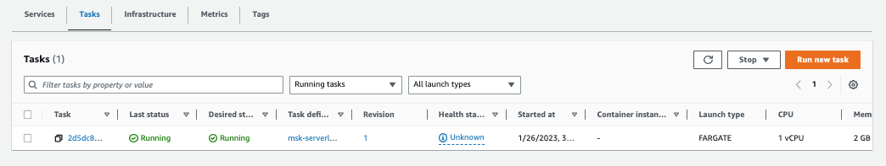

You have now successfully setup a producer ECS task that will continuously keep on producing clickstream data to Kafka topic.

# **Check schema in AWS Glue Schema Registry**

Now that the producer ECS task is running, it would create the clickstream schema in AWS Glue Schema Registry.

Navigate to [Amazon Glue console](https://us-east-2.console.aws.amazon.com/glue/home) page and select **Stream schema registries** from left menu.

You would see the schema registry name **serverless**. Click on the registry name.

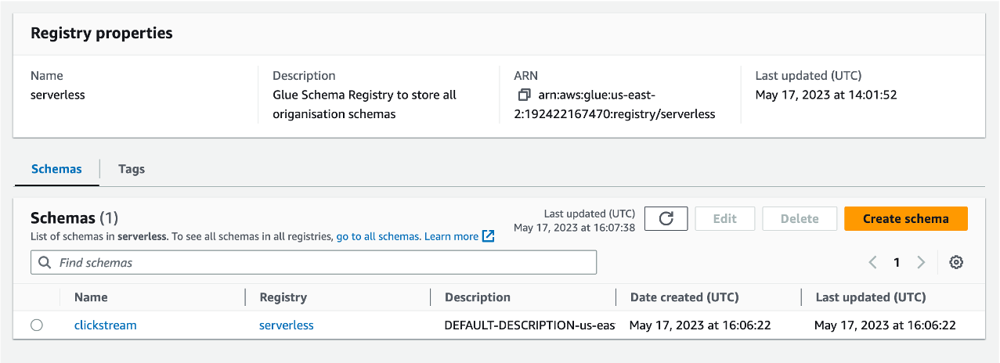

This would show the schema **clickstream** within the registry. Click on the schema name to see the schema versions. You would see the **v1** over there.

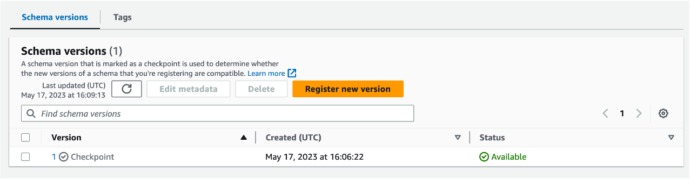

Click on the version **v1**, this would show you the avro schema of the clickstream data produced by the ECS task.

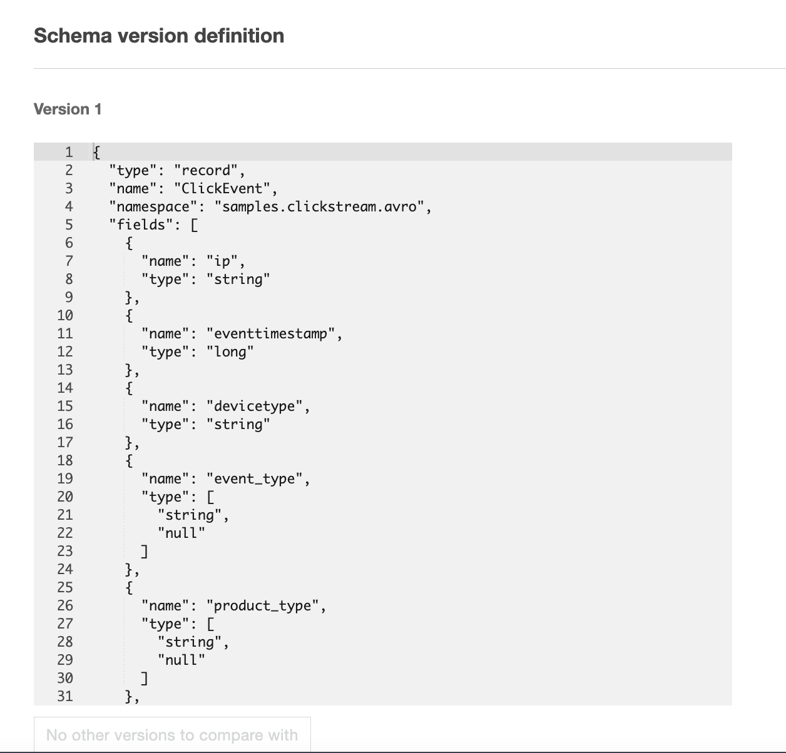
