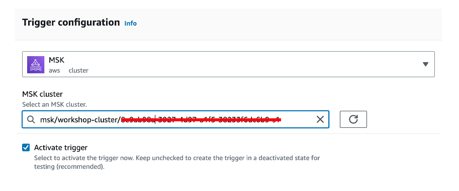
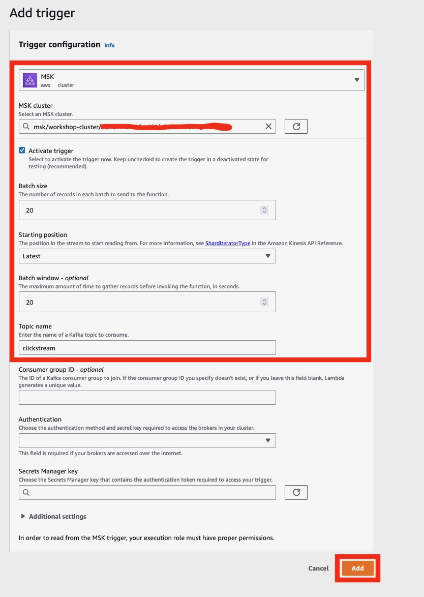
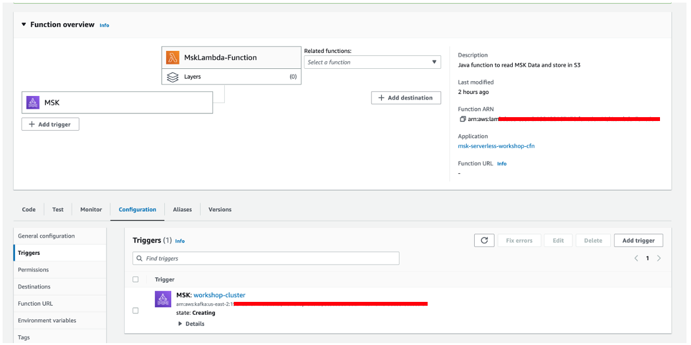
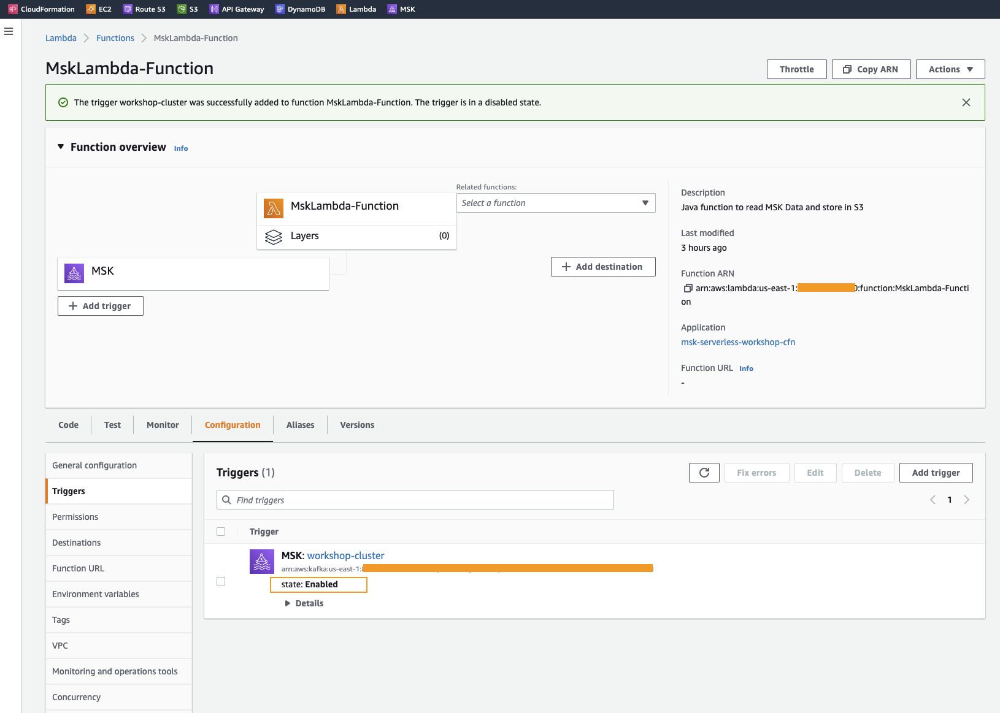

# **Consume data from MSK Serverless using Lambda**

Now that we have setup our MSK Serverless cluster we want to store the datain Amazon S3. There are various options to do that, but in this lab, we will use AWS Lambda.

The AWS Lambda function is already deployed for you in your AWS account. The only thing we need to setup is the Trigger. This Functions convert the records from Avro to CSV.

Navigate to the [AWS Lambda Console](https://us-east-2.console.aws.amazon.com/lambda/) and choose click on the **MskLambda-Function**.


## **Setup Amazon MSK Trigger**
Click on the **Add trigger** button to create a new trigger for the Lambda function.




Choose **MSK** as Source. Select your cluster in the drop down menu. Set the configuration parameters for the trigger:

```
- Batch Size: 20
- Starting Position: Latest
- Batch window: 20
- Topic name: clickstream
```

After setting the configuration click **Add** to create the trigger.



Wait for the trigger to become active (this can take a few minutes).





You have now successfully setup a Lambda functions that reads messages from a Kafka topic, transforms it into csv format and then stores it in Amazon S3.
