# **Create Quicksight Dashboard**
Now that we have transformed data, we can now use [Amazon QuickSight](https://aws.amazon.com/quicksight/) to visualize and analyze data.

## **Create a QuickSight Account**

To begin head to the [QuickSight page](https://quicksight.aws.amazon.com/) and create a new standard QuickSight account.

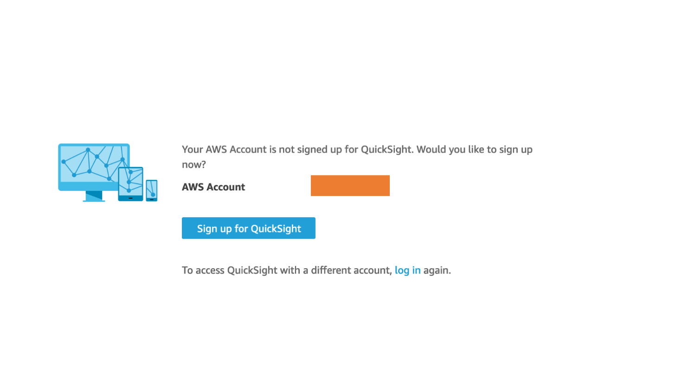

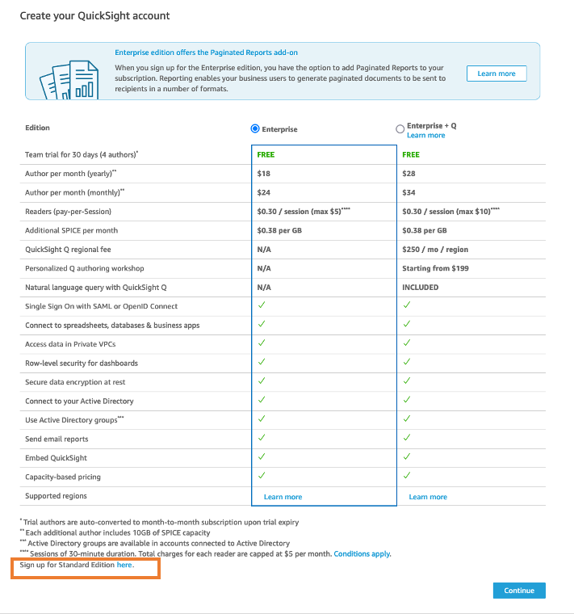

Create a unique QuickSight account user name (e.g workshopuserRANDOM_NUMBERS) and you can use a fake email address for notifications.

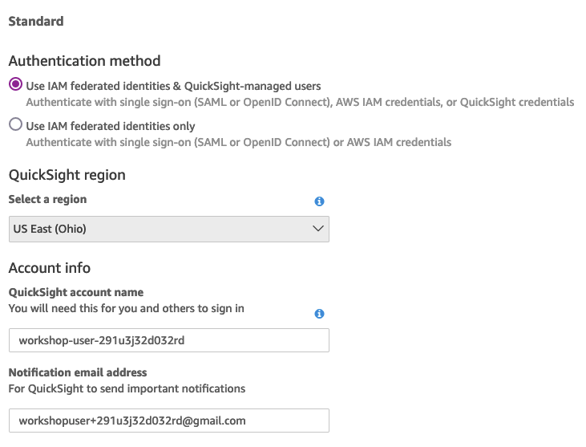

You must also select your s3 bucket with the clickstream data

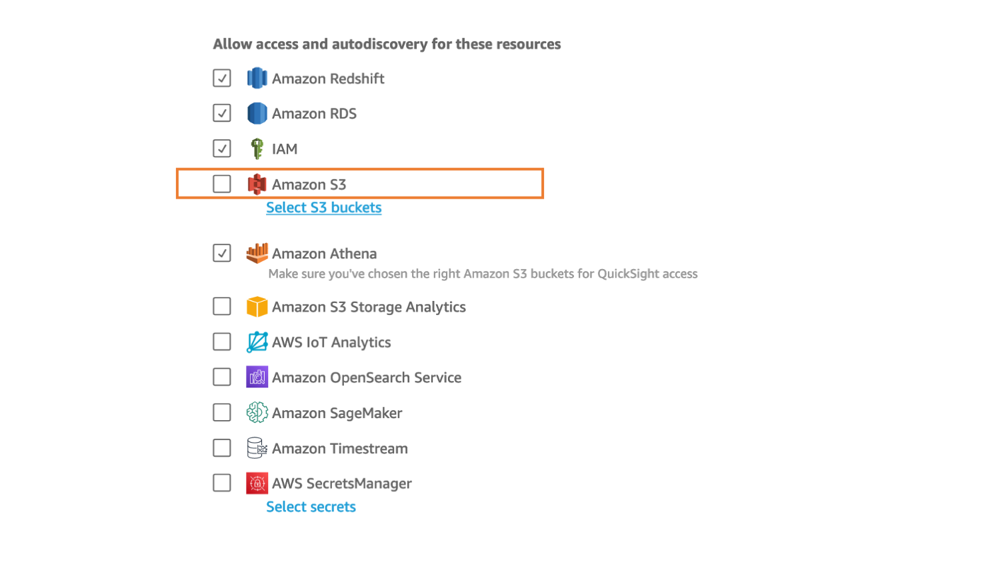

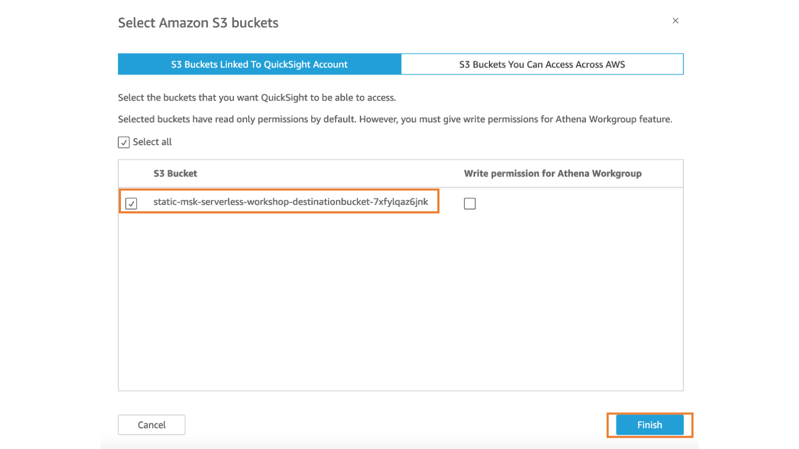

Once s3 bucket selected, you can finish and create your QuickSight Account

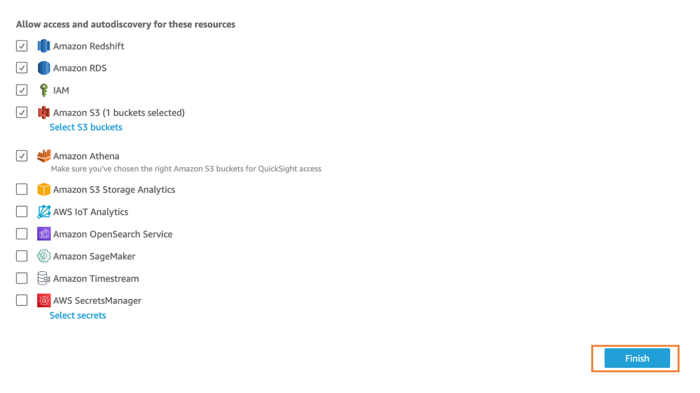

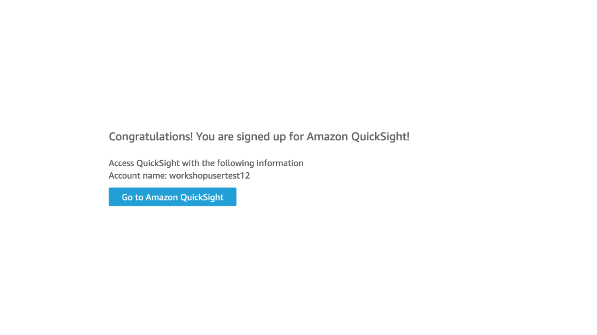

## **Creating a Dataset**
Once your account is setup head over to the [QuickSight Datasets Console](https://us-east-2.quicksight.aws.amazon.com/sn/start/data-sets). In the Dataset console click New dataset on the top right to create our dataset. Select S3 and enter a name for your dataset.

Additionally, we have to create a manifest file to specify the exact data we want to utilize for our analysis. Open a text editor and create a JSON file (e.g. quicksight_manifest.json) and enter the following. Make sure to replace YOUR_DEST_BUCKET with your destination bucket.

You may find the name of your destination bucket by navigating to the [Amazon S3 Console Page](https://s3.console.aws.amazon.com/s3/buckets?region=us-east-2). Select your bucket, copy the name from the bucket detail page, andpaste into your manifest file.

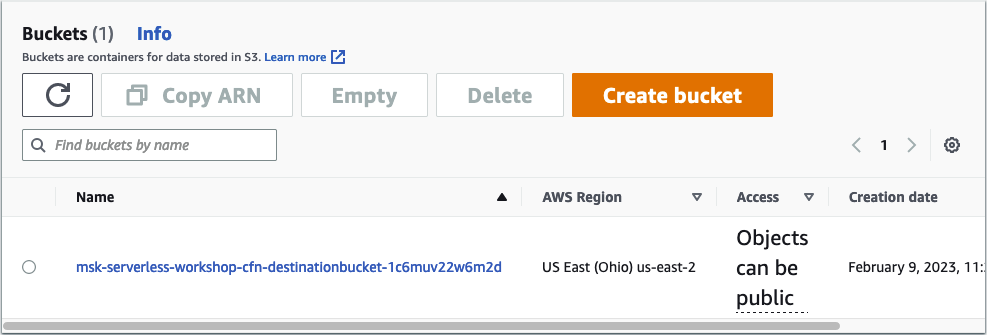

```
{
    "fileLocations": [
        {
            "URIPrefixes": [
                "s3://YOUR_DEST_BUCKET/"
            ]
        }
    ]
}
```

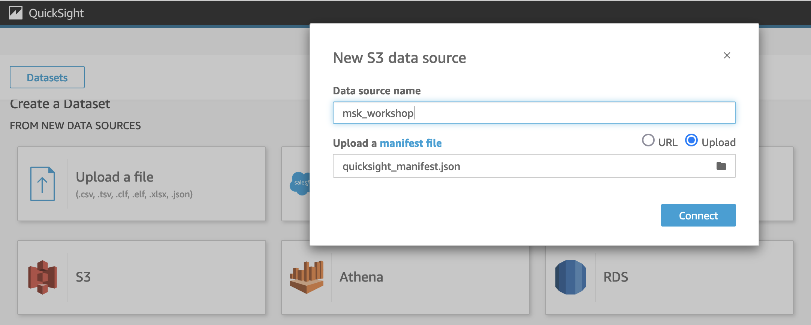

Click connect once file is uploaded, then press Visualize to get to the QuickSight analysis creator.
You will be presented with the following pop-up. Select Interactive Sheet.

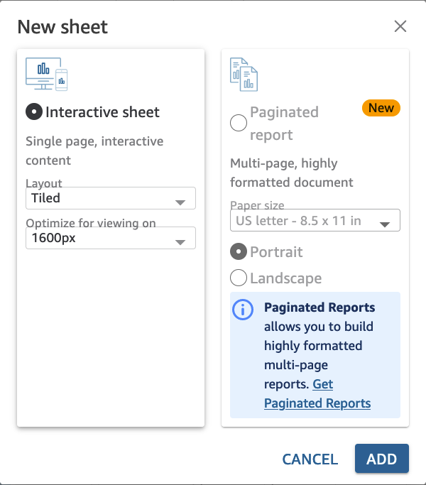

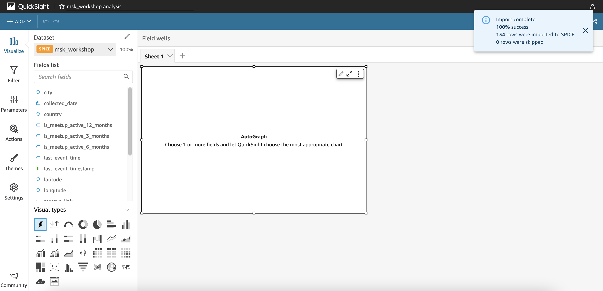

## **Playtime**
Now its Playtime, what type of graphs can you create with the data provided?

*Can you create a pie chart of the data by device type?
*How about a bar chart highlighting records by event type?
*What about a Metric that just has the total number of Events?

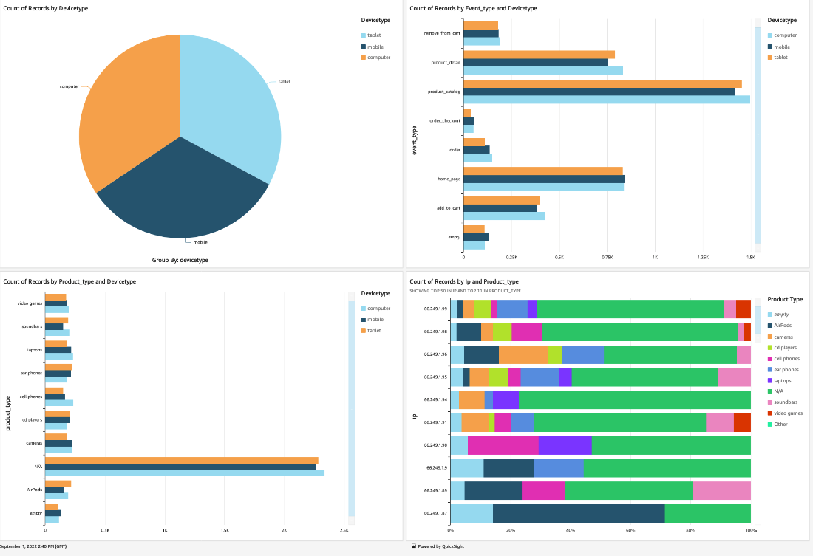

In the top right corner, you can publish your analysis as a Dashboard or export to a PDF. Feel free to check out what others around you have built.
