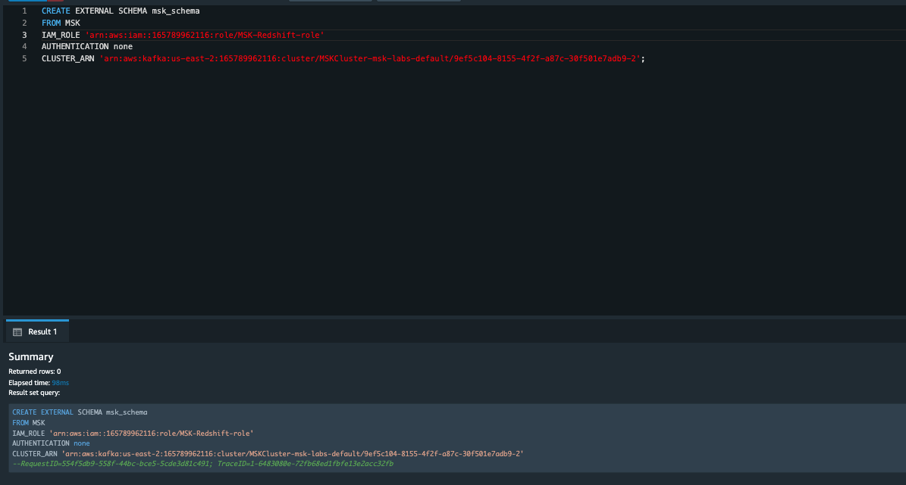

# MSK Integration with Redshift
In this lab, we will analyze real-time streaming data in Amazon MSK with Amazon Redshift.

## Solution overview

The purpose of Amazon Redshift streaming ingestion is to simplify the process for directly ingesting stream data from a streaming service into Amazon Redshift. This works with Amazon MSK and Amazon MSK Serverless. Amazon Redshift streaming ingestion removes the need to stage an Amazon MSK topic in Amazon S3 before ingesting the stream data into Amazon Redshift.

On a technical level, streaming ingestion, from Amazon Managed Streaming for Apache Kafka, provides low-latency, high-speed ingestion of stream or topic data into an Amazon Redshift materialized view. Following setup, using materialized view refresh, you can take in large data volumes.

Set up Amazon Redshift streaming ingestion for Amazon MSK by performing the following steps:

- Create an external schema that maps to the streaming data source.
- Create a materialized view that references the external schema.

> Streaming ingestion and Amazon Redshift Serverless - The configuration steps in this topic apply both to provisioned Amazon Redshift clusters and to Amazon Redshift Serverless. For more information, see Streaming ingestion considerations.

## [Fetching IAM Role info](#fetch-iam-role-arn)

1. Navigate to [Redshift console](https://us-east-1.console.aws.amazon.com/redshiftv2/home?region=us-east-1#cluster-details?cluster=redshift-cluster-1&tab=properties)


2. Scroll down to **Associated IAM roles** and click on the role **msk-redshift-role**


3. Copy the **ARN** from the Summary section. (Paste it in a note-pad)


## [Fetching MSK cluster info](#fetch-msk-arn)

1. Navigate to [MSK Console](https://us-east-1.console.aws.amazon.com/msk/home?region=us-east-1#/clusters)
2. Click on the Cluster name - **MSKCluster-msk-labs-default**
3. Copy the **ARN** from the Cluster summary section. (Paste it in a note-pad)


## Create an external schema

1. Navigate to [Redshift query editor v2](https://us-east-1.console.aws.amazon.com/sqlworkbench/home?region=us-east-1#?region=us-east-1)

 <br>
2. In the left pane, choose the redshift cluster: redshift-cluster-1
3. Once it is explanded, go to editor section and create an external schema to map to the Amazon MSK cluster.

```
CREATE EXTERNAL SCHEMA MySchema
FROM MSK
IAM_ROLE { default | 'iam-role-arn' }
AUTHENTICATION { none | iam }
CLUSTER_ARN 'msk-cluster-arn';
```

    In the FROM clause, Amazon MSK denotes that the schema maps data from Managed Kafka Services.
    
    Streaming ingestion for Amazon MSK provides the following authentication types, when you create the external schema:
    
    none – Specifies that there is no authentication step.
    
    iam – Specifies IAM authentication. When you choose this, make sure that the IAM role has permissions for IAM authentication.
    
    Additional Amazon MSK authentication methods, such as TLS authentication or a username and password, aren't supported for streaming ingestion.
    
    CLUSTER_ARN specifies the Amazon MSK cluster that you’re streaming from.


Final Command:
```
CREATE EXTERNAL SCHEMA msk_schema
FROM MSK
IAM_ROLE 'arn:aws:iam::< AWS_Account_Number >:role/msk-redshift-role'
AUTHENTICATION none 
CLUSTER_ARN 'arn:aws:kafka:us-east-1:< AWS_Account_Number >:cluster/MSKCluster-msk-labs-default/0ae312ea-a86b-44dd-xxxxxxxxxxxxxxxx';
```


Once you execute this command you should get Returned rows as 0 ( RequestID should appear in green)

## Create a Materialized view

1. Navigate to [Redshift query editor v2](https://us-east-1.console.aws.amazon.com/sqlworkbench/home?region=us-east-1#?region=us-east-1)
2. In the left pane, choose the redshift cluster: redshift-cluster-1
3. Once it is explanded, go to editor section and create a Materialized view to map topic to a queryable MV.

    **Materialized view command**:


        CREATE MATERIALIZED VIEW msk_topic_orders AUTO REFRESH YES AS
        SELECT "kafka_partition", 
        "kafka_offset", 
        "kafka_timestamp_type", 
        "kafka_timestamp", 
        "kafka_key", 
        JSON_PARSE("kafka_value") as Data, 
        "kafka_headers"
        FROM msk_schema.orders;
-> Once you execute this command you should get Returned rows as 0 ( RequestID should appear in green)


4. Refresh the view, which invokes Amazon Redshift to read from the topic and load data into the materialized view.

```
 REFRESH MATERIALIZED VIEW msk_topic_orders;
 ``` <br>
5. Query data in the materialized view:

        select data from msk_topic_orders;
-> The materialized view is updated directly from the topic when REFRESH is run. You create a materialized view that maps to the Kafka topic data source. You can perform filtering and aggregations on the data as part of the materialized view definition. Your streaming ingestion materialized view (base materialized view) can reference only one Kafka topic, but you can create additional materialized views that join with the base materialized view and with other materialized views or tables.        

**You have reached the end of workshop!**